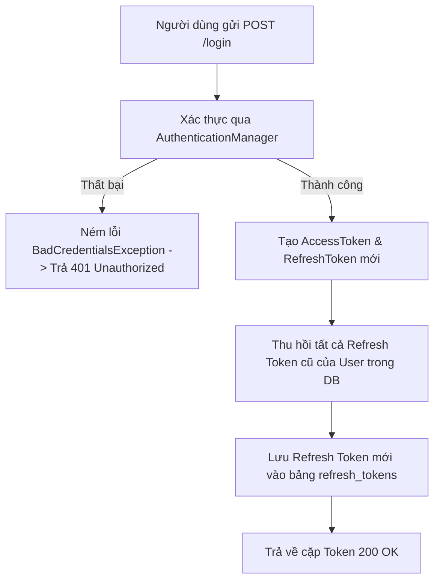

# Đặc Tả & Chi Tiết Triển Khai: Đăng Nhập Hệ Thống (FR-01)

Tính năng **Đăng nhập hệ thống (Cấp phát JWT) (FR-01)** cho phép tất cả người dùng hệ thống xác thực danh tính bằng tài khoản và mật khẩu, sau đó nhận về cặp mã khóa JWT (Access Token ngắn hạn và Refresh Token dài hạn) để sử dụng cho các yêu cầu tiếp theo.

---

## 📖 Luồng Nghiệp Vụ Hệ Thống (Business Flow Explanation)

Luồng xử lý đăng nhập hệ thống được mô tả qua sơ đồ sau:



1. **Xác thực thông tin đăng nhập:**
   - Sử dụng `AuthenticationManager` của Spring Security để kiểm tra cặp `username` và `password`.
   - Nếu sai mật khẩu hoặc tài khoản không tồn tại, hệ thống ném ra `BadCredentialsException`. Bộ xử lý lỗi toàn cục sẽ chặn lại và trả về mã trạng thái **`401 Unauthorized`**.
2. **Cấp phát cặp mã khóa mới:**
   - **Access Token:** Có thời hạn sống ngắn (ví dụ: 15 phút), chứa thông tin người dùng (`subject`) và danh sách vai trò (`roles`).
   - **Refresh Token:** Có thời hạn sống dài (ví dụ: 24 giờ), dùng để cấp lại Access Token mới.
3. **Cơ chế phòng chống tấn công:**
   - Để ngăn chặn việc kẻ tấn công sở hữu Refresh Token cũ, trước khi lưu token mới, hệ thống tự động tìm kiếm tất cả các Refresh Token đang hoạt động (`isRevoked = false`) của người dùng này và cập nhật trạng thái của chúng thành **`isRevoked = true`** (Thu hồi).
4. **Lưu trữ và Phản hồi:**
   - Lưu thông tin Refresh Token mới vào bảng `refresh_tokens` kèm thời gian hết hạn (`expired_at`).
   - Trả về mã trạng thái **`200 OK`** cùng dữ liệu Token cho Client.

---

## 🚀 Tài Liệu Hướng Dẫn Gọi API (API Specification)

### 1. Đăng nhập hệ thống (`FR-01`)
*   **Method:** `POST`
*   **Path:** `/api/v1/auth/login`
*   **Access:** `Public` (Không yêu cầu token bảo mật)
*   **Body (JSON Request):**
    ```json
    {
      "username": "customer_test",
      "password": "password123"
    }
    ```

#### A. Trường hợp thành công (200 OK)
*   **Response (JSON):**
    ```json
    {
      "success": true,
      "message": "Login successfully!",
      "data": {
        "accessToken": "eyJhbGciOiJIUzI1NiIsInR5cCI6IkpXVCJ9.eyJzdWIiOiJjdXN0b21lcl90ZXN0IiwiYXV0aG9yaXRpZXMiOlsiUk9MRV9DVVNUT01FUiJdLCJpYXQiOjE3ODEwOTcxMDAsImV4cCI6MTc4MTA5NzcwMH0.signature",
        "refreshToken": "eyJhbGciOiJIUzI1NiIsInR5cCI6IkpXVCJ9.eyJzdWIiOiJjdXN0b21lcl90ZXN0IiwiYXV0aG9yaXRpZXMiOlsiUk9MRV9DVVNUT01FUiJdLCJpYXQiOjE3ODEwOTcxMDAsImV4cCI6MTc4MTEwMDcwMH0.signature"
      }
    }
    ```

#### B. Trường hợp lỗi
*   **Lỗi Validation (400 Bad Request):** (Thiếu tên đăng nhập hoặc mật khẩu)
    ```json
    {
      "timestamp": "2026-06-12T03:10:00",
      "status": 400,
      "error": "Bad Request",
      "message": "Validation failed",
      "path": "/api/v1/auth/login",
      "errors": {
        "username": "Username is required"
      }
    }
    ```
*   **Lỗi Sai Thông Tin Đăng Nhập (401 Unauthorized):** (Sai tài khoản hoặc mật khẩu)
    ```json
    {
      "timestamp": "2026-06-12T03:10:00",
      "status": 401,
      "error": "Unauthorized",
      "message": "Bad credentials",
      "path": "/api/v1/auth/login"
    }
    ```

---

## 🛠️ Kết Quả Kiểm Tra Xác Minh

Việc biên dịch hệ thống đã hoàn toàn thành công và chạy đầy đủ bộ kiểm thử:
```text
BUILD SUCCESSFUL in 17s
```
Chức năng đăng nhập hoạt động đúng chuẩn phân quyền, lưu và thu hồi token chính xác dưới cơ sở dữ liệu.
