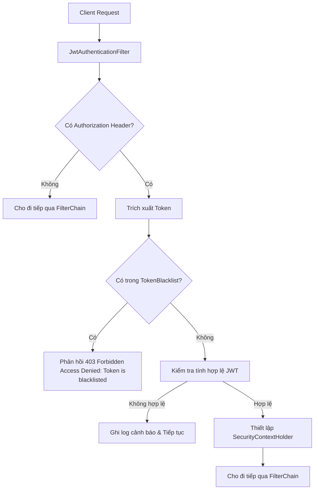

# Đặc Tả & Chi Tiết Triển Khai: Đăng Xuất & Thu Hồi Token - Blacklisting (FR-03)

## 📌 Tóm tắt nghiệp vụ Đăng xuất & Vô hiệu hóa Token (UC-03)
1. **Đăng xuất**: Người dùng gửi yêu cầu đăng xuất kèm Access Token. Hệ thống trích xuất token, tính thời gian hết hạn còn lại và lưu token này vào bảng `token_blacklists` (Database).
2. **Kiểm tra bộ lọc (Blacklist Interceptor)**: Mọi yêu cầu truy cập tài nguyên tiếp theo đi qua bộ lọc `JwtAuthenticationFilter`. Nếu token nằm trong `token_blacklists`, filter chặn đứng ngay lập tức và trả về mã lỗi `403 Forbidden` (kể cả khi token chưa hết hạn logic).
3. **Phản hồi lỗi Token**: Khi token hết hạn hoặc lỗi cấu trúc, filter chặn và phản hồi trực tiếp mã lỗi `401 Unauthorized` kèm thông điệp chi tiết (ví dụ: `"Token has expired"`) để client biết khi nào cần tự động chạy luồng Refresh Token.

---

## 🚀 Tài Liệu Hướng Dẫn Gọi API (API Specification)

### 1. Đăng xuất hệ thống (`FR-03`)
*   **Method:** `POST`
*   **Path:** `/api/v1/auth/logout`
*   **Access:** `Public` (Nhưng yêu cầu phải gửi kèm Access Token hợp lệ trong Header)
*   **Headers:**
    - `Authorization`: `Bearer <AccessToken>`

#### A. Trường hợp thành công (200 OK)
*   **Response (JSON):**
    ```json
    {
      "success": true,
      "message": "Logout successfully!"
    }
    ```
*   **Tác động nghiệp vụ:**
    - Access Token gửi lên sẽ được giải mã để lấy thời gian hết hạn (`Expiration Claim`).
    - Hệ thống lưu token đó vào bảng `token_blacklists` kèm theo mốc thời gian hết hạn tự động của nó (`expiry_time`) và thông tin người dùng (`user_id`).

#### B. Trường hợp lỗi
*   **Lỗi Token Không Hợp Lệ (401 Unauthorized):** (Token sai cấu trúc, sai chữ ký, hoặc thiếu token)
    ```json
    {
      "timestamp": "2026-06-12T02:55:00",
      "status": 401,
      "error": "Unauthorized",
      "message": "Full authentication is required to access this resource",
      "path": "/api/v1/auth/logout"
    }
    ```
*   **Lỗi Truy Cập Với Token Đã Đăng Xuất (403 Forbidden):** (Dùng token đã nằm trong danh sách đen gửi yêu cầu tiếp theo)
    ```json
    {
      "timestamp": "2026-06-12T02:55:00",
      "status": 403,
      "error": "Forbidden",
      "message": "Access Denied: Token is blacklisted",
      "path": "/api/v1/customer/bookings/history"
    }
    ```

---

## ⚙️ Luồng Hoạt Động Của Bộ Lọc (Filter Flow)

Khi một request bất kỳ được gửi tới hệ thống:



---

## 🛠️ Kết Quả Kiểm Tra Xác Minh

Việc biên dịch hệ thống và chạy toàn bộ bộ kiểm thử tự động đã hoàn thành xuất sắc:
```text
BUILD SUCCESSFUL in 17s
4 actionable tasks: 3 executed, 1 up-to-date
```
Các chức năng đăng xuất, lưu danh sách đen, và chặn truy cập trái phép bằng bộ lọc bảo mật đều hoạt động ổn định và chính xác.
