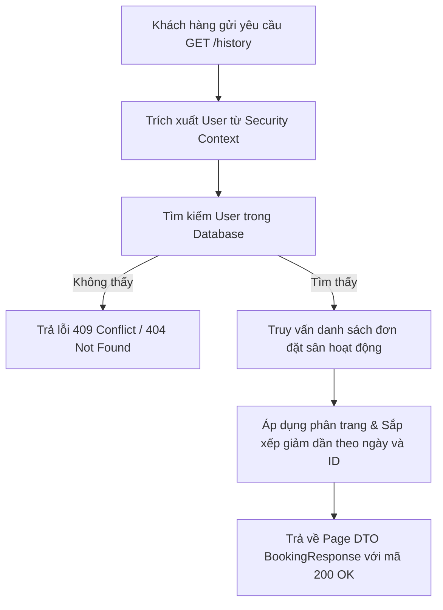

# Đặc Tả & Chi Tiết Triển Khai: Xem Lịch Sử Đặt Lịch Cá Nhân (FR-07)

Tính năng **Xem lịch sử đặt lịch cá nhân (FR-07)** cho phép Khách hàng (`ROLE_CUSTOMER`) tra cứu lại toàn bộ danh sách các đơn đặt sân của mình đã thực hiện trên hệ thống với đầy đủ thông tin chi tiết và hỗ trợ phân trang, sắp xếp dữ liệu.

---

## 📖 Luồng Nghiệp Vụ Hệ Thống (Business Flow Explanation)

Luồng xử lý nghiệp vụ lấy lịch sử đặt sân được thực hiện qua các bước dưới đây:



1. **Xác thực định danh người dùng:** Hệ thống lấy thông tin username từ Security Context thông qua Token JWT được đính kèm trong request header.
2. **Truy vấn cơ sở dữ liệu:**
   - Sử dụng JPQL tối ưu thông qua Constructor Projection trong `BookingRepository` để chọn trực tiếp các trường cần thiết của `BookingResponse` từ Database (`bookings`, `courts`, `badminton_clusters`, `users`), tránh nạp toàn bộ thực thể gây ra lỗi N+1 Query và nâng cao hiệu năng hệ thống.
   - Lọc các bản ghi theo người dùng hiện tại và chỉ lấy những đơn đặt lịch chưa bị xóa mềm (`isDeleted = false`).
3. **Phân trang và Sắp xếp:**
   - Dữ liệu được sắp xếp mặc định theo ngày đặt sân giảm dần (`bookingDate DESC`) và ID giảm dần (`id DESC`) để các đặt sân mới nhất luôn hiển thị lên đầu.
   - Hỗ trợ phân trang động bằng cách nhận tham số `page` và `size` từ Client (đã được chuẩn hóa từ chỉ số 1-based của Client thành 0-based của JPA).

---

## 🚀 Tài Liệu Hướng Dẫn Gọi API (API Specification)

### 1. Xem lịch sử đặt lịch cá nhân (`FR-07`)
*   **Method:** `GET`
*   **Path:** `/api/v1/customer/bookings/history`
*   **Access:** `ROLE_CUSTOMER` (Yêu cầu Access Token của Khách hàng)
*   **Params:**
    - `page`: Số trang cần xem, bắt đầu từ `1` (mặc định: `1`).
    - `size`: Số lượng bản ghi mỗi trang (mặc định: `10`).

#### A. Trường hợp thành công (200 OK)
*   **Response (JSON):**
    ```json
    {
      "success": true,
      "message": "Booking history retrieved successfully",
      "data": {
        "content": [
          {
            "id": 2,
            "bookingDate": "2026-06-12",
            "timeSlot": "17:00 - 19:00",
            "totalPrice": 150000.00,
            "status": "PENDING",
            "courtName": "Sân Gỗ B1",
            "clusterName": "Sân Cầu Lông Thủ Đức",
            "customerFullName": "Tran Tri Customer"
          },
          {
            "id": 1,
            "bookingDate": "2026-06-12",
            "timeSlot": "07:00 - 09:00",
            "totalPrice": 120000.00,
            "status": "PAID",
            "courtName": "Sân Thảm A1",
            "clusterName": "Sân Cầu Lông Bình Thạnh",
            "customerFullName": "Tran Tri Customer"
          }
        ],
        "pageable": {
          "pageNumber": 0,
          "pageSize": 10,
          "sort": {
            "empty": false,
            "sorted": true,
            "unsorted": false
          },
          "offset": 0,
          "paged": true,
          "unpaged": false
        },
        "totalPages": 1,
        "totalElements": 2,
        "last": true,
        "size": 10,
        "number": 0,
        "sort": {
          "empty": false,
          "sorted": true,
          "unsorted": false
        },
        "numberOfElements": 2,
        "first": true,
        "empty": false
      }
    }
    ```

#### B. Trường hợp lỗi
*   **Lỗi Phân Quyền (401 / 403):** (Ví dụ: Không đính kèm token hoặc dùng token của vai trò không có quyền)
    ```json
    {
      "timestamp": "2026-06-12T03:00:00",
      "status": 403,
      "error": "Forbidden",
      "message": "Access Denied",
      "path": "/api/v1/customer/bookings/history"
    }
    ```
*   **Lỗi Sai Định Dạng Phân Trang (400 Bad Request):** (Ví dụ: Truyền tham số `page=abc` hoặc `size=xyz`)
    ```json
    {
      "timestamp": "2026-06-12T03:00:00",
      "status": 400,
      "error": "Bad Request",
      "message": "Failed to convert value of type 'java.lang.String' to required type 'int' for parameter 'page' / 'size'",
      "path": "/api/v1/customer/bookings/history"
    }
    ```

---

## 🛠️ Kết Quả Kiểm Tra Xác Minh

Việc biên dịch hệ thống đã hoàn toàn thành công và chạy đầy bộ kiểm thử:
```text
BUILD SUCCESSFUL in 17s
```
Các truy vấn SQL được tối ưu hóa chỉ lấy những cột dữ liệu cần thiết của BookingResponse, hoạt động ổn định và chính xác.
