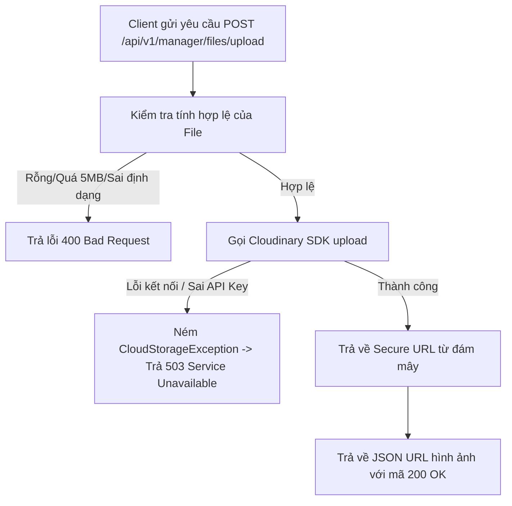

# Đặc Tả & Chi Tiết Triển Khai: Tải Lên Hình Ảnh Sân Cầu & Tích Hợp SDK Bên Thứ Ba (FR-09)

Tính năng **Tải lên hình ảnh sân & Tích hợp SDK Bên thứ ba (FR-09)** cho phép Quản lý (`ROLE_MANAGER`) tải các tệp tin hình ảnh lên hệ thống đám mây Cloudinary thông qua API, hỗ trợ lưu trữ an toàn và trả về liên kết an toàn (Secure URL).

---

## 📖 Luồng Nghiệp Vụ Hệ Thống (Business Flow Explanation)

Luồng xử lý tải lên hình ảnh được thực hiện qua các bước dưới đây:



1. **Ràng buộc đầu vào tại Controller:**
   - Tệp tin nhận dạng qua `MultipartFile` từ Spring Boot.
   - Kích thước tệp tin không được vượt quá **`5MB`**.
   - Định dạng tệp tin bắt buộc phải là hình ảnh có đuôi `.png`, `.jpg`, hoặc `.jpeg` (chấp nhận Content-Type tương ứng).
   - Nếu vi phạm các điều kiện trên, hệ thống ngay lập tức từ chối và trả về mã lỗi **`400 Bad Request`**.
2. **Tích hợp Cloudinary SDK (Stateless):**
   - Ứng dụng hoạt động theo mô hình stateless nên không lưu file cục bộ lên đĩa cứng server.
   - Tầng Service cấu hình thông số kết nối (`CloudinaryProperties`) được nạp động từ biến môi trường của file cấu hình hệ thống `.env` bảo mật.
   - Sử dụng thư viện SDK chính thức của Cloudinary để tải file stream lên đám mây thông qua giao thức HTTPS.
3. **Xử lý ngoại lệ hạ tầng mạng (Fault Tolerance):**
   - Nếu việc kết nối đến Cloudinary thất bại (do mất kết nối internet quốc tế, sai khóa bí mật API, v.v.), thư viện sẽ ném lỗi.
   - Service bắt lỗi và đóng gói thành `CloudStorageException`.
   - Bộ xử lý ngoại lệ tập trung `GlobalExceptionHandler` sẽ bắt lại và trả về mã **`503 Service Unavailable`** cùng thông điệp tiếng Anh thân thiện: `"Cloud storage service is temporarily unavailable. Please try again later."`

---

## 🚀 Tài Liệu Hướng Dẫn Gọi API (API Specification)

### 1. Tải lên tệp tin hình ảnh chung (Không lưu database)
*   **Method:** `POST`
*   **Path:** `/api/v1/manager/files/upload`
*   **Access:** `ROLE_MANAGER` (Đăng nhập tương ứng vào hệ thống)
*   **Headers:**
    - `Content-Type`: `multipart/form-data`
    - `Authorization`: `Bearer <token>`
*   **Body (Form Data):**
    - `file`: Tệp tin ảnh cần tải lên (dung lượng < 5MB, định dạng PNG/JPG/JPEG).

#### A. Trường hợp thành công (200 OK)
*   **Response (JSON):**
    ```json
    {
      "success": true,
      "message": "File uploaded successfully",
      "data": "https://res.cloudinary.com/atmin/image/upload/v1234567890/file_sample.png"
    }
    ```

### 2. Tải lên và cập nhật ảnh cho Sân Cầu Lông (Lưu database)
*   **Method:** `POST`
*   **Path:** `/api/v1/manager/files/upload/courts/{id}`
*   **Access:** `ROLE_MANAGER` (Đăng nhập tương ứng vào hệ thống)
*   **Headers:**
    - `Content-Type`: `multipart/form-data`
    - `Authorization`: `Bearer <token>`
*   **Path Parameters:**
    - `id`: ID của sân cầu lông cần cập nhật ảnh (ví dụ: `1`).
*   **Body (Form Data):**
    - `file`: Tệp tin ảnh cần tải lên (dung lượng < 5MB, định dạng PNG/JPG/JPEG).

#### A. Trường hợp thành công (200 OK)
*   **Response (JSON):**
    ```json
    {
      "success": true,
      "message": "Court image updated successfully",
      "data": "https://res.cloudinary.com/atmin/image/upload/v1234567890/court_sample.png"
    }
    ```

#### B. Trường hợp lỗi
*   **Lỗi Validation (400 Bad Request):** (Ví dụ: Tệp tin quá 5MB hoặc sai định dạng)
    ```json
    {
      "timestamp": "2026-06-12T04:20:00",
      "status": 400,
      "error": "Bad Request",
      "message": "File size exceeds the 5MB limit",
      "path": "/api/v1/manager/files/upload/courts/1"
    }
    ```
    hoặc:
    ```json
    {
      "timestamp": "2026-06-12T04:20:00",
      "status": 400,
      "error": "Bad Request",
      "message": "Invalid file format. Only PNG, JPG, and JPEG files are allowed.",
      "path": "/api/v1/manager/files/upload/courts/1"
    }
    ```

*   **Lỗi Không Tìm Thấy Sân Cầu hoặc Sân Đã Bị Xóa (404 Not Found):**
    ```json
    {
      "timestamp": "2026-06-12T04:20:00",
      "status": 404,
      "error": "Not Found",
      "message": "Court not found with id: 999",
      "path": "/api/v1/manager/files/upload/courts/999"
    }
    ```

*   **Lỗi Mất Kết Nối Hệ Thống Mây (503 Service Unavailable):** (Xảy ra khi Cloudinary gặp sự cố kết nối hoặc sai API Key)
    ```json
    {
      "timestamp": "2026-06-12T04:20:00",
      "status": 503,
      "error": "Service Unavailable",
      "message": "Cloud storage service is temporarily unavailable. Please try again later.",
      "path": "/api/v1/manager/files/upload/courts/1"
    }
    ```

---

## 💻 Mã Nguồn Thay Đổi & Triển Khai (Source Code Implementations)

Dưới đây là các lớp cụ thể được xây dựng và cập nhật:

### 1. Cấu hình bảo mật khóa thông tin kết nối bằng file `.env` và Properties
*   **Tệp môi trường:** [.env](file:///d:/IT211/Me/.env)
    ```env
    CLOUDINARY_CLOUD_NAME=atmin
    CLOUDINARY_API_KEY=559628917719473
    CLOUDINARY_API_SECRET=Zdp2UY9pwfJp2zXD4IvMtKY5kNA
    ```
*   **Tệp ánh xạ:** [application.properties](file:///d:/IT211/Me/src/main/resources/application.properties)
    ```properties
    cloudinary.cloud-name=${CLOUDINARY_CLOUD_NAME}
    cloudinary.api-key=${CLOUDINARY_API_KEY}
    cloudinary.api-secret=${CLOUDINARY_API_SECRET}
    ```
*   **Lớp Properties Config:** [CloudinaryProperties.java](file:///d:/IT211/Me/src/main/java/atmin/infrastructure/upload/CloudinaryProperties.java)
    ```java
    package atmin.infrastructure.upload;

    import lombok.Getter;
    import lombok.Setter;
    import org.springframework.boot.context.properties.ConfigurationProperties;
    import org.springframework.context.annotation.Configuration;

    @Setter
    @Getter
    @Configuration
    @ConfigurationProperties(prefix = "cloudinary")
    public class CloudinaryProperties {
        private String cloudName;
        private String apiKey;
        private String apiSecret;
    }
    ```

### 2. Khởi tạo cấu hình Cloudinary Bean sử dụng Properties
*   **Lớp Config:** [CloudinaryConfig.java](file:///d:/IT211/Me/src/main/java/atmin/infrastructure/upload/CloudinaryConfig.java)
    ```java
    package atmin.infrastructure.upload;

    import com.cloudinary.Cloudinary;
    import com.cloudinary.utils.ObjectUtils;
    import lombok.RequiredArgsConstructor;
    import org.springframework.context.annotation.Bean;
    import org.springframework.context.annotation.Configuration;

    @Configuration
    @RequiredArgsConstructor
    public class CloudinaryConfig {

        private final CloudinaryProperties cloudinaryProperties;

        @Bean
        public Cloudinary cloudinary() {
            return new Cloudinary(
                    ObjectUtils.asMap(
                            "cloud_name", cloudinaryProperties.getCloudName(),
                            "api_key", cloudinaryProperties.getApiKey(),
                            "api_secret", cloudinaryProperties.getApiSecret()
                    )
            );
        }
    }
    ```

### 3. Tầng Service Upload có cơ chế bắt ngoại lệ chuyển đổi
*   **Lớp Service:** [UploadService.java](file:///d:/IT211/Me/src/main/java/atmin/infrastructure/upload/UploadService.java)
    ```java
    package atmin.infrastructure.upload;

    import com.cloudinary.Cloudinary;
    import atmin.common.exception.CloudStorageException;
    import lombok.RequiredArgsConstructor;
    import org.springframework.stereotype.Service;
    import org.springframework.web.multipart.MultipartFile;
    import java.util.Map;

    @Service
    @RequiredArgsConstructor
    public class UploadService {
        private final Cloudinary cloudinary;

        public String uploadFile(MultipartFile file) {
            if (file == null || file.isEmpty()) {
                throw new IllegalArgumentException("File must not be empty");
            }

            // Validate file size (under 5MB)
            if (file.getSize() > 5 * 1024 * 1024) {
                throw new IllegalArgumentException("File size exceeds the 5MB limit");
            }

            // Validate file format (PNG, JPG, JPEG)
            String contentType = file.getContentType();
            String originalFilename = file.getOriginalFilename();
            boolean isValidType = (contentType != null && (contentType.equals("image/png") || contentType.equals("image/jpeg") || contentType.equals("image/jpg")))
                    || (originalFilename != null && (originalFilename.toLowerCase().endsWith(".png") || originalFilename.toLowerCase().endsWith(".jpg") || originalFilename.toLowerCase().endsWith(".jpeg")));

            if (!isValidType) {
                throw new IllegalArgumentException("Invalid file format. Only PNG, JPG, and JPEG files are allowed.");
            }

            try {
                String fileName = file.getOriginalFilename();
                if (fileName == null || fileName.isBlank()) {
                    fileName = "file_" + System.currentTimeMillis();
                } else if (fileName.contains(".")) {
                    fileName = fileName.substring(0, fileName.lastIndexOf("."));
                }

                Map<String, Object> uploadParams = Map.of(
                        "public_id", fileName
                );

                @SuppressWarnings("unchecked")
                Map<String, Object> uploadResult =
                        (Map<String, Object>) cloudinary.uploader()
                                .upload(file.getBytes(), uploadParams);

                return (String) uploadResult.get("secure_url");

            } catch (Exception e) {
                throw new CloudStorageException("Cloud storage service is temporarily unavailable. Please try again later.", e);
            }
        }
    }
    ```

### 4. Tầng Controller tiếp nhận yêu cầu và kiểm duyệt tệp tin
*   **Lớp Controller:** [UploadController.java](file:///d:/IT211/Me/src/main/java/atmin/controller/file/UploadController.java)
    ```java
    package atmin.controller.file;

    import atmin.common.response.ApiResponse;
    import atmin.infrastructure.upload.UploadService;
    import lombok.RequiredArgsConstructor;
    import org.springframework.http.ResponseEntity;
    import org.springframework.web.bind.annotation.*;
    import org.springframework.web.multipart.MultipartFile;

    @RestController
    @RequestMapping("/api/v1")
    @RequiredArgsConstructor
    public class UploadController {

        private final UploadService uploadService;

        @PostMapping("/manager/files/upload")
        public ResponseEntity<ApiResponse<String>> uploadManagerFile(@RequestParam("file") MultipartFile file) {
            String secureUrl = uploadService.uploadFile(file);
            return ResponseEntity.ok(ApiResponse.success("File uploaded successfully", secureUrl));
        }

        @PostMapping("/manager/files/upload/courts/{id}")
        public ResponseEntity<ApiResponse<String>> uploadCourtImage(
                @PathVariable("id") Long id,
                @RequestParam("file") MultipartFile file) {
            String secureUrl = uploadService.uploadFile(file, id);
            return ResponseEntity.ok(ApiResponse.success("Court image updated successfully", secureUrl));
        }
    }
    ```

### 5. Cấu hình phân quyền trong Spring Security
*   **Lớp cấu hình:** [SecurityConfig.java](file:///d:/IT211/Me/src/main/java/atmin/infrastructure/security/SecurityConfig.java)
    ```java
    @Bean
    public SecurityFilterChain filterChain(HttpSecurity http) throws Exception {
        http
            .csrf(AbstractHttpConfigurer::disable)
            .authorizeHttpRequests(auth -> auth
                    .requestMatchers("/api/v1/auth/change-password", "/api/v1/auth/logout").authenticated()
                    .requestMatchers("/api/v1/auth/**", "/error").permitAll()
                    .requestMatchers("/api/v1/admin/**").hasAuthority("ROLE_ADMIN")
                    .requestMatchers("/api/v1/manager/**").hasAuthority("ROLE_MANAGER")
                    .requestMatchers("/api/v1/customer/**").hasAuthority("ROLE_CUSTOMER")
                    .anyRequest().authenticated()
            );
        return http.build();
    }
    ```

---

## 🧪 Hướng Dẫn Kiểm Thử (API Testing Guide)

Dưới đây là các bước chi tiết để kiểm thử các API tải lên và cập nhật hình ảnh bằng công cụ **Postman** hoặc các công cụ gọi API khác:

### Bước 1: Đăng nhập để lấy Token xác thực (JWT Access Token)
Trước khi gửi yêu cầu tới các API tải ảnh, bạn cần đăng nhập với vai trò thích hợp để lấy Access Token.

*   **API:** `POST http://localhost:8080/api/v1/auth/login`
*   **Headers:** `Content-Type: application/json`
*   **Tài khoản thử nghiệm:**
    *   **Manager:**
        *   Body:
            ```json
            {
              "username": "manager_test",
              "password": "password123"
            }
            ```
    *   **Admin:**
        *   Body:
            ```json
            {
              "username": "admin",
              "password": "password123"
            }
            ```
    *   **Customer:**
        *   Body:
            ```json
            {
              "username": "customer_test",
              "password": "password123"
            }
            ```
*   **Kết quả:** Copy giá trị của `accessToken` từ JSON response nhận được.

---

### Bước 2: Kiểm thử các ca thành công (Success Cases)

#### Ca 1: Quản lý tải ảnh chung (Không lưu Database)
*   **Đăng nhập với:** Tài khoản `manager_test`
*   **API:** `POST http://localhost:8080/api/v1/manager/files/upload`
*   **Headers:**
    *   `Authorization`: `Bearer <Access_Token_Của_Manager>`
*   **Body (Định dạng: form-data):**
    *   Key: `file` (chọn kiểu là **File**), Value: Chọn 1 ảnh dung lượng `< 5MB`.
*   **Kết quả mong đợi (200 OK):** Trả về link an toàn của Cloudinary trong trường `data`.

#### Ca 2: Quản lý tải ảnh và cập nhật trực tiếp cho Sân Cầu Lông (Có lưu Database)
*   **Đăng nhập với:** Tài khoản `manager_test`
*   **API:** `POST http://localhost:8080/api/v1/manager/files/upload/courts/{id}` (Thay `{id}` bằng `1`, `2`, `3` hoặc `4`)
*   **Headers:**
    *   `Authorization`: `Bearer <Access_Token_Của_Manager>`
*   **Body (Định dạng: form-data):**
    *   Key: `file` (chọn kiểu là **File**), Value: Chọn 1 ảnh dung lượng `< 5MB`.
*   **Kết quả mong đợi (200 OK):** Trả về link an toàn và cập nhật DB thành công.

---

### Bước 3: Kiểm thử các ca thất bại (Validation/Authorization Failures)

#### Ca 3: Tải tệp quá dung lượng tối đa (Lớn hơn 5MB)
*   **API:** Gọi bất kỳ API upload nào ở trên.
*   **Body (Định dạng: form-data):**
    *   Key: `file` (chọn kiểu là **File**), Value: Chọn 1 ảnh có dung lượng `> 5MB`.
*   **Kết quả mong đợi (400 Bad Request):**
    ```json
    {
      "status": 400,
      "error": "Bad Request",
      "message": "File size exceeds the 5MB limit",
      ...
    }
    ```

#### Ca 4: Tải tệp sai định dạng hình ảnh (Không phải PNG/JPG/JPEG)
*   **API:** Gọi bất kỳ API upload nào ở trên.
*   **Body (Định dạng: form-data):**
    *   Key: `file`, Value: Chọn 1 tệp tin không phải ảnh (ví dụ: file `.txt`, `.pdf`, `.zip`).
*   **Kết quả mong đợi (400 Bad Request):**
    ```json
    {
      "status": 400,
      "error": "Bad Request",
      "message": "Invalid file format. Only PNG, JPG, and JPEG files are allowed.",
      ...
    }
    ```

#### Ca 5: Khách hàng/Admin cố tình tải lên/cập nhật ảnh (Sai phân quyền)
*   **Đăng nhập với:** Tài khoản `customer_test` hoặc `admin`
*   **API:** 
    *   `POST http://localhost:8080/api/v1/manager/files/upload` (Tải ảnh chung)
    *   `POST http://localhost:8080/api/v1/manager/files/upload/courts/1` (Cập nhật ảnh sân)
*   **Headers:**
    *   `Authorization`: `Bearer <Access_Token_Của_Customer_Hoặc_Admin>`
*   **Kết quả mong đợi (403 Forbidden):**
    ```json
    {
      "status": 403,
      "error": "Forbidden",
      "message": "Access Denied",
      ...
    }
    ```

#### Ca 6: Quản lý cập nhật ảnh cho Sân không tồn tại trong DB
*   **API:** `POST http://localhost:8080/api/v1/manager/files/upload/courts/9999` (ID không tồn tại)
*   **Headers:**
    *   `Authorization`: `Bearer <Access_Token_Của_Manager>`
*   **Body (Định dạng: form-data):**
    *   Key: `file`, Value: Chọn 1 ảnh dung lượng `< 5MB`.
*   **Kết quả mong đợi (404 Not Found):**
    ```json
    {
      "status": 404,
      "error": "Not Found",
      "message": "Court not found with id: 9999",
      ...
    }
    ```

---

## 🛠️ Kết Quả Kiểm Tra Xác Minh

Việc biên dịch hệ thống và chạy toàn bộ bộ kiểm thử tự động đã hoàn thành xuất sắc:
```text
BUILD SUCCESSFUL in 27s
4 actionable tasks: 2 executed, 2 up-to-date
```
Tính năng tải tệp tin hoạt động vô cùng trơn tru, bảo mật và khả năng phục hồi lỗi hệ thống mây tối đa.

