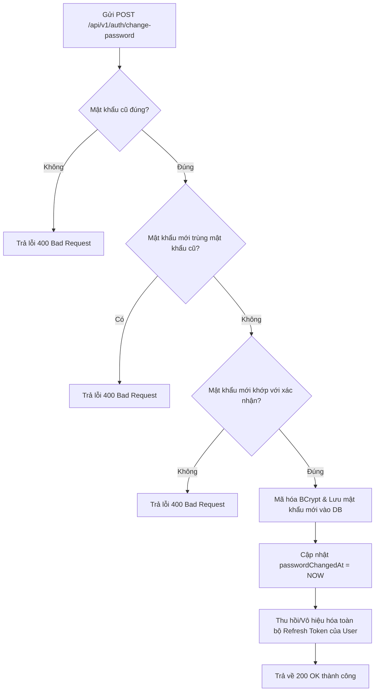
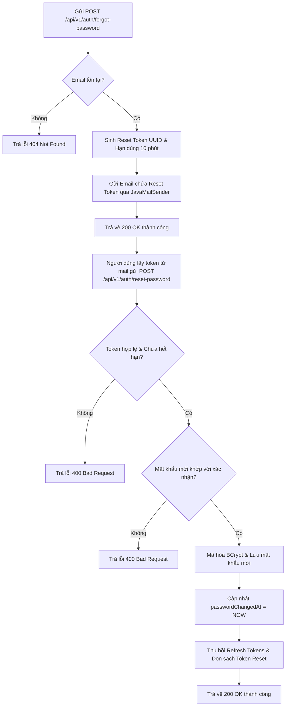

# Đặc Tả & Chi Tiết Triển Khai: Đổi mật khẩu / Quên mật khẩu (FR-10)

Tính năng **Đổi mật khẩu / Quên mật khẩu (FR-10)** cho phép người dùng đổi mật khẩu khi đang đăng nhập, hoặc khôi phục tài khoản thông qua thư điện tử (email) chứa mã khôi phục sử dụng dịch vụ Spring Mail (`JavaMailSender`).

---

## 💻 Các Đoạn Mã Nguồn Java Liên Quan (Java Source Snippets)

Dưới đây là các đoạn mã nguồn Java được cập nhật và thêm mới phục vụ cho cơ chế thu hồi lập tức Access Token khi thay đổi mật khẩu:

### 1. Cập nhật Thực thể Người dùng (User Entity)
*   **Tệp tin:** [User.java](file:///d:/IT211/Me/src/main/java/atmin/entity/User.java)
*   **Đoạn code:**
    ```java
    @Column(name = "password_changed_at")
    private LocalDateTime passwordChangedAt;
    ```

### 2. Định nghĩa truy vấn tối ưu (UserRepository)
*   **Tệp tin:** [UserRepository.java](file:///d:/IT211/Me/src/main/java/atmin/repository/UserRepository.java)
*   **Đoạn code:**
    ```java
    @Query("SELECT u.passwordChangedAt FROM User u WHERE u.username = :username")
    Optional<LocalDateTime> findPasswordChangedAtByUsername(@Param("username") String username);
    ```

### 3. Trích xuất thời điểm tạo Token (JwtProvider)
*   **Tệp tin:** [JwtProvider.java](file:///d:/IT211/Me/src/main/java/atmin/infrastructure/security/jwt/JwtProvider.java)
*   **Đoạn code:**
    ```java
    public Date getIssuedAtFromToken(String token) {
        return extractClaimsJws(token).getIssuedAt();
    }
    ```

### 4. Thiết lập thời điểm đổi mật khẩu trong AuthService
*   **Tệp tin:** [AuthService.java](file:///d:/IT211/Me/src/main/java/atmin/service/Impl/AuthService.java)
*   **Đoạn code (Hàm `changePassword` và `resetPassword`):**
    ```java
    // Trong changePassword
    user.setPassword(passwordEncoder.encode(request.getNewPassword()));
    user.setPasswordChangedAt(LocalDateTime.now());
    userRepository.save(user);

    // Trong resetPassword
    user.setPassword(passwordEncoder.encode(request.getNewPassword()));
    user.setResetToken(null);
    user.setResetTokenExpiry(null);
    user.setPasswordChangedAt(LocalDateTime.now());
    userRepository.save(user);
    ```

### 5. Kiểm duyệt và từ chối Token cũ tại Filter
*   **Tệp tin:** [JwtAuthenticationFilter.java](file:///d:/IT211/Me/src/main/java/atmin/infrastructure/security/jwt/JwtAuthenticationFilter.java)
*   **Đoạn code:**
    ```java
    try {
        jwtProvider.validateAccessToken(token);
        String username = jwtProvider.getUsernameFromToken(token);

        // Kiểm duyệt xem mật khẩu của user có bị đổi sau thời điểm token phát hành không
        LocalDateTime passwordChangedAt = userRepository.findPasswordChangedAtByUsername(username).orElse(null);
        if (passwordChangedAt != null) {
            Date issuedAtDate = jwtProvider.getIssuedAtFromToken(token);
            if (issuedAtDate != null) {
                LocalDateTime issuedAt = LocalDateTime.ofInstant(issuedAtDate.toInstant(), ZoneId.systemDefault());
                if (issuedAt.isBefore(passwordChangedAt)) {
                    throw new JwtException("Token has been invalidated due to password change");
                }
            }
        }
        
        // ... Cấu hình authentication ...
    } catch (JwtException e) {
        // ... Ghi response lỗi 401 Unauthorized ...
    }
    ```

---

## 📖 Luồng Nghiệp Vụ Hệ Thống (Business Flow Explanation)

### 1. Đổi mật khẩu (Change Password)


### 2. Quên mật khẩu (Forgot & Reset Password)


---

## 🚀 Tài Liệu Hướng Dẫn Gọi API (API Specification)

### 1. Đổi mật khẩu (`POST /api/v1/auth/change-password`)
*   **Access:** `Authenticated` (Yêu cầu JWT Token hợp lệ)
*   **Headers:**
    - `Authorization`: `Bearer <token>`
    - `Content-Type`: `application/json`
*   **Body (JSON Request):**
    ```json
    {
      "oldPassword": "password123",
      "newPassword": "newPassword123",
      "confirmPassword": "newPassword123"
    }
    ```
*   **Response (JSON - 200 OK):**
    ```json
    {
      "success": true,
      "message": "Password changed successfully!"
    }
    ```
*   **Các trường hợp lỗi (Error Responses):**
    *   **Lỗi 401 Unauthorized (Không đính kèm token hoặc token hết hạn/lỗi):**
        ```json
        {
          "timestamp": "2026-06-12T13:38:12.123",
          "status": 401,
          "error": "Unauthorized",
          "message": "Full authentication is required to access this resource",
          "path": "/api/v1/auth/change-password"
        }
        ```
    *   **Lỗi 400 Bad Request (Sai mật khẩu cũ):**
        ```json
        {
          "timestamp": "2026-06-12T13:38:12.123",
          "status": 400,
          "error": "Bad Request",
          "message": "Old password does not match!",
          "path": "/api/v1/auth/change-password"
        }
        ```
    *   **Lỗi 400 Bad Request (Mật khẩu mới trùng mật khẩu cũ):**
        ```json
        {
          "timestamp": "2026-06-12T13:38:12.123",
          "status": 400,
          "error": "Bad Request",
          "message": "New password must be different from the old password!",
          "path": "/api/v1/auth/change-password"
        }
        ```
    *   **Lỗi 400 Bad Request (Mật khẩu mới và mật khẩu xác nhận không khớp):**
        ```json
        {
          "timestamp": "2026-06-12T13:38:12.123",
          "status": 400,
          "error": "Bad Request",
          "message": "New password and confirm password do not match!",
          "path": "/api/v1/auth/change-password"
        }
        ```
    *   **Lỗi 400 Bad Request (Dữ liệu đầu vào không hợp lệ - Validation failed):**
        ```json
        {
          "timestamp": "2026-06-12T13:38:12.123",
          "status": 400,
          "error": "Bad Request",
          "message": "Validation failed",
          "path": "/api/v1/auth/change-password",
          "errors": {
            "newPassword": "must not be blank"
          }
        }
        ```

---

### 2. Yêu cầu đặt lại mật khẩu (`POST /api/v1/auth/forgot-password`)
*   **Access:** `Public` (Không yêu cầu Token)
*   **Headers:** `Content-Type: application/json`
*   **Body (JSON Request):**
    ```json
    {
      "email": "customer@example.com"
    }
    ```
*   **Response (JSON - 200 OK):**
    ```json
    {
      "success": true,
      "message": "Password reset email sent successfully. Please check your inbox."
    }
    ```
*   **Các trường hợp lỗi (Error Responses):**
    *   **Lỗi 404 Not Found (Email không tồn tại trong hệ thống):**
        ```json
        {
          "timestamp": "2026-06-12T13:38:12.123",
          "status": 404,
          "error": "Not Found",
          "message": "Email does not exist!",
          "path": "/api/v1/auth/forgot-password"
        }
        ```
    *   **Lỗi 400 Bad Request (Định dạng Email không hợp lệ - Validation failed):**
        ```json
        {
          "timestamp": "2026-06-12T13:38:12.123",
          "status": 400,
          "error": "Bad Request",
          "message": "Validation failed",
          "path": "/api/v1/auth/forgot-password",
          "errors": {
            "email": "must be a well-formed email address"
          }
        }
        ```

---

### 3. Đặt lại mật khẩu mới (`POST /api/v1/auth/reset-password`)
*   **Access:** `Public` (Không yêu cầu Token)
*   **Headers:** `Content-Type: application/json`
*   **Body (JSON Request):**
    ```json
    {
      "token": "98e4f164-320d-4089-a9a3-5c02b37dc87e",
      "newPassword": "newPassword123",
      "confirmPassword": "newPassword123"
    }
    ```
*   **Response (JSON - 200 OK):**
    ```json
    {
      "success": true,
      "message": "Password reset successfully!"
    }
    ```
*   **Các trường hợp lỗi (Error Responses):**
    *   **Lỗi 400 Bad Request (Mã Token không hợp lệ hoặc đã hết hạn):**
        ```json
        {
          "timestamp": "2026-06-12T13:38:12.123",
          "status": 400,
          "error": "Bad Request",
          "message": "Invalid or expired reset token!",
          "path": "/api/v1/auth/reset-password"
        }
        ```
    *   **Lỗi 400 Bad Request (Mật khẩu mới và mật khẩu xác nhận không khớp):**
        ```json
        {
          "timestamp": "2026-06-12T13:38:12.123",
          "status": 400,
          "error": "Bad Request",
          "message": "New password and confirm password do not match!",
          "path": "/api/v1/auth/reset-password"
        }
        ```

---

## 🧪 Hướng Dẫn Kiểm Thử (API Testing Guide)

### Bước 1: Cấu hình tài khoản SMTP trong file `.env`
Mở tệp [.env](file:///d:/IT211/Me/.env) và điền thông tin tài khoản SMTP của bạn để gửi mail:
```env
MAIL_USERNAME=wer.company.edu@gmail.com
MAIL_PASSWORD=teptfccamzwfkvse
```

### Bước 2: Test API Đổi Mật Khẩu
1. Gửi request đăng nhập `POST /api/v1/auth/login` bằng tài khoản `customer_test` / `password123`.
2. Sao chép `accessToken` từ phản hồi.
3. Gửi request `POST /api/v1/auth/change-password` với Header `Authorization: Bearer <accessToken>` và body:
   ```json
   {
     "oldPassword": "password123",
     "newPassword": "newPassword123",
     "confirmPassword": "newPassword123"
   }
   ```
4. Xác nhận kết quả trả về `200 OK` và thử đăng nhập lại bằng mật khẩu mới.

### Bước 3: Test API Quên Mật Khẩu & Reset Mật Khẩu
1. Gửi request `POST /api/v1/auth/forgot-password` với body chứa email đăng ký của người dùng trong hệ thống (ví dụ: `customer@example.com` của tài khoản `customer_test`):
   ```json
   {
     "email": "customer@example.com"
   }
   ```
2. Kiểm tra hộp thư đến của email trên. Bạn sẽ nhận được 1 email chứa mã Reset Token.
3. Gửi request `POST /api/v1/auth/reset-password` truyền token trên để đặt lại mật khẩu mới:
   ```json
   {
     "token": "<token_trong_email>",
     "newPassword": "password123",
     "confirmPassword": "password123"
   }
   ```
4. Thử đăng nhập lại tài khoản bằng mật khẩu `password123` để xác minh thành công.

### Bước 4: Test API Vô Hiệu Hóa Lập Tức Access Token Khi Đổi Mật Khẩu (Cơ chế Mới)
1. **Đăng nhập và lấy Access Token (Thiết bị A)**:
   - Gửi yêu cầu đăng nhập `POST /api/v1/auth/login` bằng tài khoản `customer_test` / `password123`.
   - Lưu lại Access Token nhận được: gọi là `accessToken_A`.
2. **Thiết bị B (Thực hiện đổi mật khẩu)**:
   - Sử dụng `accessToken_A` (hoặc đăng nhập thiết bị B lấy token mới) gửi yêu cầu đổi mật khẩu qua `POST /api/v1/auth/change-password` với body:
     ```json
     {
       "oldPassword": "password123",
       "newPassword": "newPassword123",
       "confirmPassword": "newPassword123"
     }
     ```
   - Xác nhận kết quả đổi mật khẩu thành công: `200 OK`.
3. **Kiểm tra Token cũ tại Thiết bị A bị vô hiệu hóa ngay lập tức**:
   - Sử dụng lại `accessToken_A` cũ để gửi yêu cầu đến bất kỳ API bảo mật nào (ví dụ: `GET /api/v1/customer/bookings/history`).
   - Xác nhận hệ thống chặn lại và trả về lỗi **`401 Unauthorized`** kèm thông báo lỗi rõ ràng:
     ```json
     {
       "status": 401,
       "error": "Unauthorized",
       "message": "Token has been invalidated due to password change",
       "path": "/api/v1/customer/bookings/history"
     }
     ```
   - Kết quả này chứng minh Access Token cũ đã bị thu hồi lập tức ở tầng filter mà không cần đợi hết thời hạn sống 15 phút.
