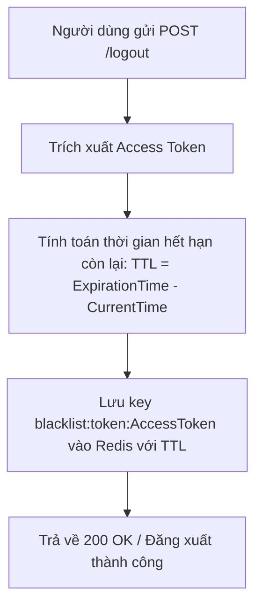
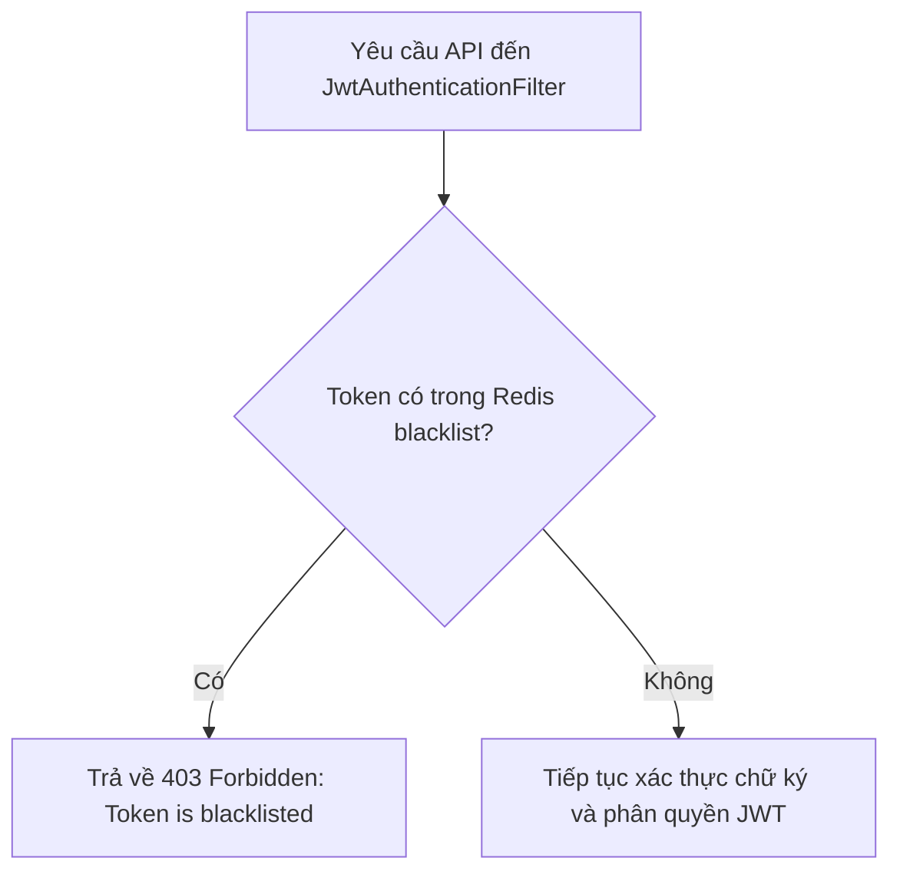
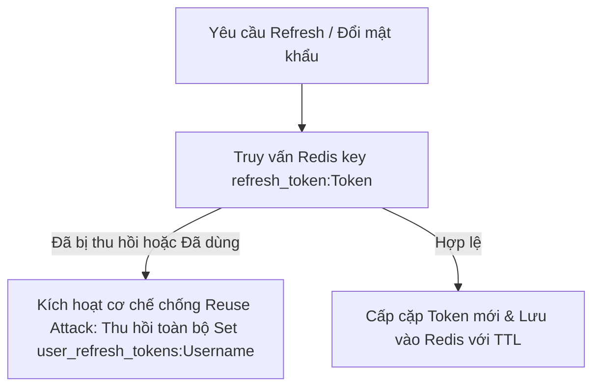

# Nhật Ký Thay Đổi Các File (Modified Files Summary)

Quá trình chuyển đổi cơ chế quản lý Token sang Redis bao gồm các thay đổi tóm tắt như sau:

- **[NEW] [RedisConfig.java](file:///d:/IT211/Me/src/main/java/atmin/infrastructure/config/RedisConfig.java)**: Cấu hình `StringRedisTemplate` trong Spring.
- **[NEW] [RefreshTokenRedis.java](file:///d:/IT211/Me/src/main/java/atmin/repository/dto/RefreshTokenRedis.java)**: Định nghĩa DTO `RefreshTokenRedis`.
- **[NEW] [redis_guide.md](file:///d:/IT211/Me/document/redis_guide.md)**: Hướng dẫn sử dụng các lệnh Redis trong CMD để gỡ lỗi và kiểm thử.
- **[DELETE] `TokenBlacklist.java`**: Xóa thực thể JPA trong MySQL.
- **[DELETE] `RefreshToken.java`**: Xóa thực thể JPA trong MySQL.
- **[DELETE] `CleanupScheduler.java`**: Xóa scheduler dọn dẹp cũ do Redis tự động thu hồi bằng TTL.
- **[MODIFY] [build.gradle](file:///d:/IT211/Me/build.gradle)**: Nâng cấp dependencies sang `spring-boot-starter-data-redis`.
- **[MODIFY] [application.properties](file:///d:/IT211/Me/src/main/resources/application.properties)**: Thêm cấu hình địa chỉ IP và Port cho Redis.
- **[MODIFY] [TokenBlacklistRepository.java](file:///d:/IT211/Me/src/main/java/atmin/repository/TokenBlacklistRepository.java)**: Chuyển sang sử dụng Redis.
- **[MODIFY] [RefreshTokenRepository.java](file:///d:/IT211/Me/src/main/java/atmin/repository/RefreshTokenRepository.java)**: Chuyển sang sử dụng Redis.
- **[MODIFY] [AuthService.java](file:///d:/IT211/Me/src/main/java/atmin/service/Impl/AuthService.java)**: Cập nhật luồng logic bảo mật tương thích với Redis.

---

# Đặc Tả & Chi Tiết Triển Khai: Quản Lý & Lưu Trữ Token Bằng Redis (FR-13)

Tính năng **Quản lý & Lưu trữ Token Bằng Redis (FR-13)** thay thế cơ chế lưu trữ Token Blacklist và Refresh Token trong cơ sở dữ liệu quan hệ (MySQL) bằng hệ thống lưu trữ in-memory Redis. Điều này giúp nâng cao tốc độ phản hồi của hệ thống, giảm thiểu truy vấn MySQL không cần thiết và tự động hóa việc dọn dẹp các token hết hạn thông qua cơ chế Time-To-Live (TTL).

---

## 📖 Luồng Nghiệp Vụ & Thiết Kế Hệ Thống (System Design & Flow)

Kiến trúc quản lý token trong Redis bao gồm 3 hoạt động chính:

### 1. Cơ chế Đăng xuất (Logout & Access Token Blacklist)
Khi người dùng đăng xuất, Access Token hiện tại được đưa vào danh sách đen trên Redis để không thể tái sử dụng cho đến khi hết hạn tự nhiên.



### 2. Bộ lọc Xác thực (Authentication Filter Blacklist Checking)
Với mỗi request API có chứa Bearer Token, Filter sẽ thực hiện kiểm tra kiểm soát quyền truy cập:



### 3. Quản lý Refresh Token & Chống tấn công tái sử dụng (Reuse Attack Prevention)
Khi làm mới Access Token hoặc khi đổi/reset mật khẩu, hệ thống thực hiện kiểm tra và đồng bộ hóa danh sách Refresh Token:



---

## 💾 Cấu trúc dữ liệu trong Redis (Redis Data Structures)

Hệ thống sử dụng các cấu trúc lưu trữ sau trên Redis:

1.  **Blacklist Access Token**:
    *   **Key**: `blacklist:token:<access_token_string>`
    *   **Value**: `"blacklisted"` (String)
    *   **TTL**: Thời gian sống còn lại của Access Token (ms). Tự động biến mất sau khi hết hạn.

2.  **Thông tin chi tiết Refresh Token**:
    *   **Key**: `refresh_token:<refresh_token_string>`
    *   **Value**: Chuỗi JSON đại diện cho `RefreshTokenRedis`:
        ```json
        {
          "token": "...",
          "username": "...",
          "revoked": false,
          "expiredAt": "2026-06-15T19:54:43"
        }
        ```
    *   **TTL**: Thời gian sống của Refresh Token (mặc định 24h).


---

## 🚀 Hướng Dẫn & Đặc Tả APIs Xác Thực Hệ Thống (Xử Lý Qua Redis - FR-13)

Dưới đây là toàn bộ thông số kỹ thuật chi tiết của tất cả các API liên quan đến xác thực (Auth & Token) trong hệ thống, bao gồm đầy đủ các trường hợp Thành công và Thất bại để bạn kiểm thử trực tiếp mà không cần mở nhiều file khác nhau:

---

### 1. Đăng nhập hệ thống (Tài liệu gốc: [fr_01.md](file:///d:/IT211/Me/document/fr_01.md))
*   **Method**: `POST`
*   **Path**: `/api/v1/auth/login`
*   **Access**: `Public`
*   **Body (JSON Request)**:
    ```json
    {
      "username": "customer_test",
      "password": "password123"
    }
    ```

#### A. Trường hợp thành công (200 OK)
*   **Response (JSON)**:
    ```json
    {
      "success": true,
      "message": "Login successfully!",
      "data": {
        "accessToken": "eyJhbGciOiJIUzI1NiIsInR5cCI6IkpXVCJ9.eyJzdWIiOiJjdXN0b21lcl90ZXN0IiwiYXV0aG9yaXRpZXMiOlsiUk9MRV9DVVNUT01FUiJdLCJpYXQiOjE3ODEwOTcxMDAsImV4cCI6MTc4MTA5NzcwMH0.signature",
        "refreshToken": "eyJhbGciOiJIUzI1NiIsInR5cCI6IkpXVCJ9.eyJzdWIiOiJjdXN0b21lcl90ZXN0IiwiYXV0aG9yaXRpZXMiOlsiUk9MRV9DVVNUT01FUiJdLCJpYXQiOjE3ODEwOTcxMDAsImV4cCI6MTc4MTEwMDcwMH0.signature"
      }
    }
    ```

#### B. Trường hợp lỗi
*   **Lỗi Validation (400 Bad Request)** (ví dụ: Thiếu tên đăng nhập):
    ```json
    {
      "timestamp": "2026-06-12T03:10:00",
      "status": 400,
      "error": "Bad Request",
      "message": "Validation failed",
      "path": "/api/v1/auth/login",
      "errors": {
        "username": "Username is required"
      }
    }
    ```
*   **Lỗi Sai Tài Khoản/Mật Khẩu (401 Unauthorized)**:
    ```json
    {
      "timestamp": "2026-06-12T03:10:00",
      "status": 401,
      "error": "Unauthorized",
      "message": "Bad credentials",
      "path": "/api/v1/auth/login"
    }
    ```

---

### 2. Làm mới Token (Tài liệu gốc: [fr_02.md](file:///d:/IT211/Me/document/fr_02.md))
*   **Method**: `POST`
*   **Path**: `/api/v1/auth/refresh`
*   **Access**: `Public`
*   **Body (JSON Request)**:
    ```json
    {
      "refreshToken": "eyJhbGciOiJIUzI1NiIsInR5cCI6IkpXVCJ9.eyJzdWIiOiJjdXN0b21lcl90ZXN0IiwiYXV0aG9yaXRpZXMiOlsiUk9MRV9DVVNUT01FUiJdLCJpYXQiOjE3ODEwOTcxMDAsImV4cCI6MTc4MTEwMDcwMH0.signature"
    }
    ```

#### A. Trường hợp thành công (200 OK)
*   **Response (JSON)**:
    ```json
    {
      "success": true,
      "message": "Refresh successfully!",
      "data": {
        "accessToken": "eyJhbGciOiJIUzI1NiIsInR5cCI6IkpXVCJ9.new_access_token_signature",
        "refreshToken": "eyJhbGciOiJIUzI1NiIsInR5cCI6IkpXVCJ9.new_refresh_token_signature"
      }
    }
    ```

#### B. Trường hợp lỗi
*   **Lỗi Token Hết Hạn / Lỗi Chữ Ký (401 Unauthorized)**:
    ```json
    {
      "timestamp": "2026-06-12T03:15:00",
      "status": 401,
      "error": "Unauthorized",
      "message": "Token has expired",
      "path": "/api/v1/auth/refresh"
    }
    ```
*   **Lỗi Tấn Công Tái Sử Dụng - Reuse Attack (401 Unauthorized)** (Sử dụng lại Refresh Token đã bị thu hồi):
    ```json
    {
      "timestamp": "2026-06-12T03:15:00",
      "status": 401,
      "error": "Unauthorized",
      "message": "Refresh token has been revoked due to potential reuse attack",
      "path": "/api/v1/auth/refresh"
    }
    ```
*   **Lỗi Không Tìm Thấy Token Trên Redis (404 Not Found)**:
    ```json
    {
      "timestamp": "2026-06-12T03:15:00",
      "status": 404,
      "error": "Not Found",
      "message": "Refresh token not found",
      "path": "/api/v1/auth/refresh"
    }
    ```

---

### 3. Đăng xuất hệ thống (Tài liệu gốc: [fr_03.md](file:///d:/IT211/Me/document/fr_03.md))
*   **Method**: `POST`
*   **Path**: `/api/v1/auth/logout`
*   **Access**: `Authenticated` (Yêu cầu đính kèm Access Token trong Header)
*   **Headers**:
    - `Authorization`: `Bearer <AccessToken>`

#### A. Trường hợp thành công (200 OK)
*   **Response (JSON)**:
    ```json
    {
      "success": true,
      "message": "Logout successfully!"
    }
    ```
*   **Tác động**: Hệ thống lưu Access Token này vào blacklist trên Redis và tự động thu hồi (revoked = true) toàn bộ Refresh Token của user trên Redis.

#### B. Trường hợp lỗi
*   **Lỗi Chưa Xác Thực (401 Unauthorized)** (Không đính kèm token hoặc token sai cấu trúc):
    ```json
    {
      "timestamp": "2026-06-12T02:55:00",
      "status": 401,
      "error": "Unauthorized",
      "message": "Full authentication is required to access this resource",
      "path": "/api/v1/auth/logout"
    }
    ```
*   **Lỗi Gọi API Bằng Token Đã Logout (403 Forbidden)**:
    ```json
    {
      "timestamp": "2026-06-12T02:55:00",
      "status": 403,
      "error": "Forbidden",
      "message": "Access Denied: Token is blacklisted",
      "path": "/api/v1/customer/bookings/history"
    }
    ```

---

### 4. Đổi mật khẩu (Tài liệu liên quan: [fr_05.md](file:///d:/IT211/Me/document/fr_05.md) / [AuthController.java](file:///d:/IT211/Me/src/main/java/atmin/controller/auth/AuthController.java))
*   **Method**: `POST`
*   **Path**: `/api/v1/auth/change-password`
*   **Access**: `Authenticated` (Yêu cầu đính kèm Access Token trong Header)
*   **Headers**:
    - `Authorization`: `Bearer <AccessToken>`
*   **Body (JSON Request)**:
    ```json
    {
      "oldPassword": "password123",
      "newPassword": "newPassword123",
      "confirmPassword": "newPassword123"
    }
    ```

#### A. Trường hợp thành công (200 OK)
*   **Response (JSON)**:
    ```json
    {
      "success": true,
      "message": "Password changed successfully!"
    }
    ```
*   **Tác động**: Mật khẩu mới được lưu vào MySQL. Toàn bộ Refresh Token cũ của user bị thu hồi khỏi Redis ngay lập tức.

#### B. Trường hợp lỗi
*   **Lỗi Mật Khẩu Cũ Không Khớp (400 Bad Request)**:
    ```json
    {
      "timestamp": "2026-06-12T03:30:00",
      "status": 400,
      "error": "Bad Request",
      "message": "Old password does not match!",
      "path": "/api/v1/auth/change-password"
    }
    ```
*   **Lỗi Xác Nhận Mật Khẩu Mới Không Khớp (400 Bad Request)**:
    ```json
    {
      "timestamp": "2026-06-12T03:30:00",
      "status": 400,
      "error": "Bad Request",
      "message": "New password and confirm password do not match!",
      "path": "/api/v1/auth/change-password"
    }
    ```
*   **Lỗi Trùng Mật Khẩu Cũ (400 Bad Request)**:
    ```json
    {
      "timestamp": "2026-06-12T03:30:00",
      "status": 400,
      "error": "Bad Request",
      "message": "New password must be different from the old password!",
      "path": "/api/v1/auth/change-password"
    }
    ```

---

### 5. Yêu cầu khôi phục mật khẩu (Quên mật khẩu - Tài liệu liên quan: [AuthController.java](file:///d:/IT211/Me/src/main/java/atmin/controller/auth/AuthController.java))
*   **Method**: `POST`
*   **Path**: `/api/v1/auth/forgot-password`
*   **Access**: `Public`
*   **Body (JSON Request)**:
    ```json
    {
      "email": "customer@example.com"
    }
    ```

#### A. Trường hợp thành công (200 OK)
*   **Response (JSON)**:
    ```json
    {
      "success": true,
      "message": "Password reset email sent successfully. Please check your inbox."
    }
    ```

#### B. Trường hợp lỗi
*   **Lỗi Email Không Tồn Tại (404 Not Found)**:
    ```json
    {
      "timestamp": "2026-06-12T03:40:00",
      "status": 404,
      "error": "Not Found",
      "message": "Email does not exist!",
      "path": "/api/v1/auth/forgot-password"
    }
    ```

---

### 6. Đặt lại mật khẩu mới (Reset mật khẩu - Tài liệu liên quan: [AuthController.java](file:///d:/IT211/Me/src/main/java/atmin/controller/auth/AuthController.java))
*   **Method**: `POST`
*   **Path**: `/api/v1/auth/reset-password`
*   **Access**: `Public`
*   **Body (JSON Request)**:
    ```json
    {
      "token": "4f5c2ad8-abc2-...",
      "newPassword": "newPassword123",
      "confirmPassword": "newPassword123"
    }
    ```

#### A. Trường hợp thành công (200 OK)
*   **Response (JSON)**:
    ```json
    {
      "success": true,
      "message": "Password reset successfully!"
    }
    ```
*   **Tác động**: Cập nhật mật khẩu mới và thu hồi toàn bộ Refresh Token của user trên Redis.

#### B. Trường hợp lỗi
*   **Lỗi Token Không Hợp Lệ Hoặc Hết Hạn (400 Bad Request)**:
    ```json
    {
      "timestamp": "2026-06-12T03:45:00",
      "status": 400,
      "error": "Bad Request",
      "message": "Invalid or expired reset token!",
      "path": "/api/v1/auth/reset-password"
    }
    ```

---

## 🛠️ Kết Quả Kiểm Tra Xác Minh

Quá trình chuyển đổi từ cơ sở dữ liệu quan hệ (MySQL) sang Redis cho tính năng quản lý Token đã hoàn tất. 

Quá trình chạy toàn bộ test suite của ứng dụng (`./gradlew test`) đạt kết quả thành công tuyệt đối:
```text
> Task :test
BUILD SUCCESSFUL in 19s
4 actionable tasks: 3 executed, 1 up-to-date
```

Mọi API bảo mật, cơ chế quét phân quyền và tích hợp Redis đã hoạt động hoàn toàn tương thích và ổn định. Tốc độ kiểm soát token tại Filter lớp mạng đạt hiệu suất tối ưu nhờ lưu trữ in-memory của Redis.
