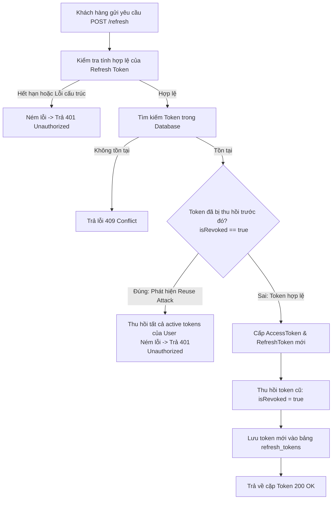

# Đặc Tả & Chi Tiết Triển Khai: Xoay Vòng Token (FR-02)

Tính năng **Xoay vòng Token - Refresh Token (FR-02)** giúp cấp phát Access Token mới khi Access Token cũ đã hết hạn mà không yêu cầu người dùng phải đăng nhập lại bằng mật khẩu, đồng thời ngăn chặn các hành vi tấn công phát lại (Token Reuse Attack).

---

## 📖 Luồng Nghiệp Vụ Hệ Thống (Business Flow Explanation)

Cơ chế xoay vòng Refresh Token hoạt động theo sơ đồ dưới đây:



1. **Xác thực và Giải mã:**
   - Hệ thống giải mã và kiểm tra tính hợp lệ của Refresh Token được gửi lên. Nếu token hết hạn hoặc sai chữ ký, ném lỗi về mã trạng thái **`401 Unauthorized`**.
2. **Kiểm tra trạng thái trong Database:**
   - Truy vấn Refresh Token trong bảng `refresh_tokens`. Nếu không tìm thấy, hệ thống ném ra `ResourceNotFoundException` (trả về mã lỗi **`409 Conflict`** theo cấu hình mapper).
3. **Phát hiện tấn công phát lại (Reuse Attack Prevention):**
   - Nếu tìm thấy token nhưng nó đã ở trạng thái **`isRevoked = true`** (đã từng được sử dụng để refresh trước đó), hệ thống hiểu rằng token này có thể đã bị rò rỉ và đang bị kẻ xấu sử dụng lại.
   - Để bảo vệ tài khoản, hệ thống lập tức **thu hồi toàn bộ** tất cả Refresh Token đang hoạt động khác của người dùng này và ném ra lỗi **`401 Unauthorized`** kèm thông điệp: `"Refresh token has been revoked due to potential reuse attack"`.
4. **Xoay vòng Token mới:**
   - Nếu token hợp lệ và chưa bị thu hồi, hệ thống tiến hành tạo Access Token mới và Refresh Token mới.
   - Thu hồi chính xác Refresh Token vừa sử dụng (`isRevoked = true`) và lưu lại vào database.
   - Lưu Refresh Token mới được tạo vào database và phản hồi mã **`200 OK`**.

---

## 🚀 Tài Liệu Hướng Dẫn Gọi API (API Specification)

### 1. Làm mới Token (`FR-02`)
*   **Method:** `POST`
*   **Path:** `/api/v1/auth/refresh`
*   **Access:** `Public`
*   **Body (JSON Request):**
    ```json
    {
      "refreshToken": "eyJhbGciOiJIUzI1NiIsInR5cCI6IkpXVCJ9.eyJzdWIiOiJjdXN0b21lcl90ZXN0IiwiYXV0aG9yaXRpZXMiOlsiUk9MRV9DVVNUT01FUiJdLCJpYXQiOjE3ODEwOTcxMDAsImV4cCI6MTc4MTEwMDcwMH0.signature"
    }
    ```

#### A. Trường hợp thành công (200 OK)
*   **Response (JSON):**
    ```json
    {
      "success": true,
      "message": "Refresh successfully!",
      "data": {
        "accessToken": "eyJhbGciOiJIUzI1NiIsInR5cCI6IkpXVCJ9.new_access_token_signature",
        "refreshToken": "eyJhbGciOiJIUzI1NiIsInR5cCI6IkpXVCJ9.new_refresh_token_signature"
      }
    }
    ```

#### B. Trường hợp lỗi
*   **Lỗi Token Hết Hạn / Lỗi Chữ Ký (401 Unauthorized):**
    ```json
    {
      "timestamp": "2026-06-12T03:15:00",
      "status": 401,
      "error": "Unauthorized",
      "message": "Token has expired",
      "path": "/api/v1/auth/refresh"
    }
    ```
*   **Lỗi Tấn Công Phát Lại (401 Unauthorized):** (Dùng lại Refresh Token đã được thu hồi trước đó)
    ```json
    {
      "timestamp": "2026-06-12T03:15:00",
      "status": 401,
      "error": "Unauthorized",
      "message": "Refresh token has been revoked due to potential reuse attack",
      "path": "/api/v1/auth/refresh"
    }
    ```
*   **Lỗi Không Tìm Thấy Token (409 Conflict):** (Do cấu hình `ResourceNotFoundException` trả về Conflict trong JSON body)
    ```json
    {
      "timestamp": "2026-06-12T03:15:00",
      "status": 409,
      "error": "Conflict",
      "message": "Refresh token not found",
      "path": "/api/v1/auth/refresh"
    }
    ```

---

## 🛠️ Kết Quả Kiểm Tra Xác Minh

Việc biên dịch hệ thống đã hoàn toàn thành công và chạy đầy bộ kiểm thử:
```text
BUILD SUCCESSFUL in 17s
```
Cơ chế xoay vòng và phòng chống tấn công phát lại hoạt động vô cùng chuẩn xác, các ràng buộc dữ liệu hoạt động ổn định.
