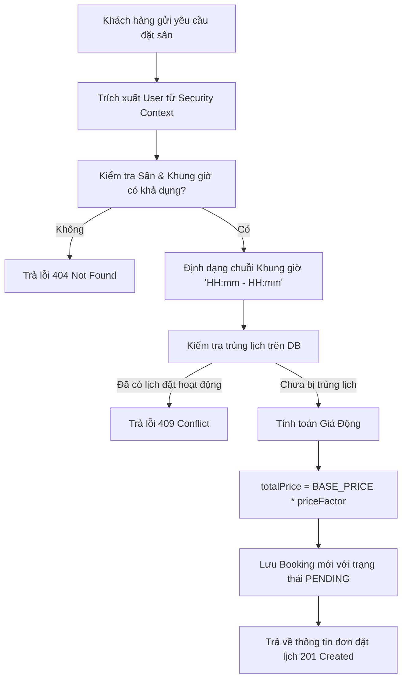

# Đặc Tả & Chi Tiết Triển Khai: Đặt Lịch Đánh Cầu (FR-06)

Tính năng **Đặt lịch đánh cầu (FR-06)** cho phép Khách hàng (`ROLE_CUSTOMER`) lựa chọn sân cầu lông và khung giờ mong muốn trong một ngày để tạo đơn đặt lịch, đồng thời hỗ trợ tra cứu lịch sử đặt sân cá nhân.

---

## 📖 Luồng Nghiệp Vụ Hệ Thống (Business Flow Explanation)

Luồng xử lý nghiệp vụ đặt sân được thực hiện tự động qua các bước nghiêm ngặt sau:



1. **Xác thực định danh người dùng:** Hệ thống tự động lấy thông tin người dùng đang đăng nhập thông qua mã JWT đính kèm trong request header. Tài khoản này phải tồn tại trong CSDL và có quyền `ROLE_CUSTOMER`.
2. **Kiểm tra tính khả dụng của tài nguyên:**
   * Sân cầu lông (`Court`) được chọn phải tồn tại, đang hoạt động (`isAvailable = true`) và chưa bị xóa mềm (`isDeleted = false`).
   * Khung giờ đặt sân (`TimeSlot`) phải tồn tại, khả dụng (`isAvailable = true`) và chưa bị xóa mềm.
3. **Xác minh tránh trùng lịch đặt (Double Booking Prevention):**
   * Hệ thống tự động chuyển đổi thông tin giờ của `TimeSlot` thành chuỗi đại diện (ví dụ: `07:00 - 09:00`).
   * Truy vấn CSDL để tìm kiếm xem có đơn đặt lịch nào cùng **Sân**, cùng **Ngày**, cùng **Khung giờ** ở trạng thái đang hoạt động (không phải trạng thái `'CANCELLED'`) hay không. Nếu phát hiện trùng lặp, hệ thống ngay lập tức từ chối và ném ra lỗi trùng tài nguyên (`DuplicateResourceException`).
4. **Tính toán giá động:** Giá cơ bản được quy định cố định trong mã nguồn là **`100,000 VND`**. Hệ thống sẽ lấy giá cơ bản này nhân với hệ số giá (`priceFactor`) của khung giờ tương ứng để ra tổng tiền cuối cùng.
   * *Ví dụ:* Giờ thấp điểm (hệ số 1.0) giá sẽ là `100,000 VND`. Giờ cao điểm (hệ số 1.5) giá sẽ là `150,000 VND`.
5. **Trạng thái mặc định:** Đơn đặt lịch mới tạo luôn mặc định có trạng thái ban đầu là **`PENDING`** (chờ phê duyệt hoặc thanh toán).
6. **Cơ chế Ghi nhật ký tự động bằng AOP (Audit Logging Details):**
   Để đảm bảo tính độc lập và sạch sẽ cho tầng nghiệp vụ (Separation of Concerns), logic ghi log không được viết trong Service hay Controller. Thay vào đó, lớp Aspect **`LoggingAspect`** tự động can thiệp và thu thập thông tin như sau:

   * **Điểm can thiệp (Pointcut):** Aspect bao bọc quanh phương thức nghiệp vụ đặt sân của tầng Service:
     `execution(* atmin.service.IBookingService.createBooking(..))`
   * **Trường hợp đặt sân thành công (`@AfterReturning`):**
     * **Cơ chế hoạt động:** Chạy sau khi Service thực hiện xong và trả về kết quả thành công mà không ném lỗi.
     * **Thông tin thu thập được:** Aspect trích xuất thông tin trực tiếp từ đối tượng **`BookingResponse`** trả về:
       * Tên khách hàng đặt sân: `response.getCustomerFullName()`
       * Tên sân cầu lông: `response.getCourtName()`
       * Ngày đặt sân: `response.getBookingDate()`
       * Khung giờ đặt sân: `response.getTimeSlot()`
     * **Mẫu nhật ký (Success Log):**
       `[AUDIT - SUCCESS] Khách hàng Tran Tri Customer đặt thành công Sân Thảm A1 vào ngày 2026-06-12, Khung giờ 07:00 - 09:00.`
   * **Trường hợp đặt sân thất bại (`@AfterThrowing`):**
     * **Cơ chế hoạt động:** Chạy khi Service xảy ra ngoại lệ (ví dụ: trùng lịch, không tìm thấy sân/giờ, v.v.). Lúc này Service không trả về kết quả, Aspect sẽ bắt lấy exception được ném ra.
     * **Thông tin thu thập được:** Aspect thu thập thông tin từ các nguồn khác nhau:
       * **Thông tin khách hàng:** Lấy từ **`SecurityContextHolder`** (context bảo mật hiện tại):
         `SecurityContextHolder.getContext().getAuthentication().getName()` để xác định tên đăng nhập cố gắng thực hiện hành động.
       * **Thông tin sân đặt lịch:** Lấy từ **đối số truyền vào** của phương thức Service (`JoinPoint.getArgs()`). Đối số thứ nhất chính là **`BookingRequest`**, từ đó trích xuất ra `request.getCourtId()` để biết ID của sân bị lỗi.
       * **Thông tin lỗi:** Trích xuất từ thông điệp của ngoại lệ ném ra (`ex.getMessage()`).
     * **Mẫu nhật ký (Failed Log):**
       `[AUDIT - FAILED] Khách hàng customer_test cố gắng đặt Sân số 1 nhưng thất bại do This court has already been booked for this time slot on the selected date!.`

---


## 🚀 Tài Liệu Hướng Dẫn Gọi API (API Specification)

### 1. Đặt lịch đánh cầu (`FR-06`)
*   **Method:** `POST`
*   **Path:** `/api/v1/customer/bookings`
*   **Access:** `ROLE_CUSTOMER` (Yêu cầu JWT Token của Khách hàng)
*   **Body (JSON Request):**
    ```json
    {
      "courtId": 1,
      "bookingDate": "2026-06-12",
      "timeSlotId": 2
    }
    ```

#### A. Trường hợp thành công (201 Created)
*   **Response (JSON):**
    ```json
    {
      "success": true,
      "message": "Booking created successfully",
      "data": {
        "id": 3,
        "bookingDate": "2026-06-12",
        "timeSlot": "07:00 - 09:00",
        "totalPrice": 120000.00,
        "status": "PENDING",
        "courtName": "Sân Thảm A1",
        "clusterName": "Sân Cầu Lông Bình Thạnh",
        "customerFullName": "Tran Tri Customer"
      }
    }
    ```

#### B. Trường hợp lỗi
*   **Lỗi Validation (400 Bad Request):** (Ví dụ: Ngày đặt ở quá khứ hoặc thiếu thông tin)
    ```json
    {
      "timestamp": "2026-06-11T06:05:00",
      "status": 400,
      "error": "Bad Request",
      "message": "Validation failed",
      "path": "/api/v1/customer/bookings",
      "errors": {
        "bookingDate": "Booking date must be in the present or future"
      }
    }
    ```
*   **Lỗi Trùng Lịch Đặt (409 Conflict):** (Khung giờ này vào ngày này của sân đã bị người khác đặt trước)
    ```json
    {
      "timestamp": "2026-06-11T06:05:00",
      "status": 409,
      "error": "Conflict",
      "message": "This court has already been booked for this time slot on the selected date!",
      "path": "/api/v1/customer/bookings"
    }
    ```
*   **Lỗi Không Tìm Thấy Sân / Khung Giờ (404 Not Found):** (HTTP Status: 404, Body status: 409)
    ```json
    {
      "timestamp": "2026-06-11T06:05:00",
      "status": 409,
      "error": "Conflict",
      "message": "Court not found or is unavailable: 99",
      "path": "/api/v1/customer/bookings"
    }
    ```
*   **Lỗi Phân Quyền (401 / 403):** (Ví dụ: Dùng token của ADMIN hoặc không truyền token)
    ```json
    {
      "timestamp": "2026-06-11T06:05:00",
      "status": 403,
      "error": "Forbidden",
      "message": "Access Denied",
      "path": "/api/v1/customer/bookings"
    }
    ```

---

### 2. Xem lịch sử đặt lịch cá nhân
- Tính năng này đã được tách riêng thành tài liệu đặc tả độc lập **[FR-07]**.
- Vui lòng xem chi tiết đặc tả API và luồng nghiệp vụ tại: [Đặc Tả Xem Lịch Sử Đặt Lịch Cá Nhân (FR-07)](file:///d:/IT211/Me/fr_07.md)

---

## 🛠️ Kết Quả Kiểm Tra Xác Minh

Việc biên dịch hệ thống đã hoàn toàn thành công:
```text
BUILD SUCCESSFUL in 8s
```
