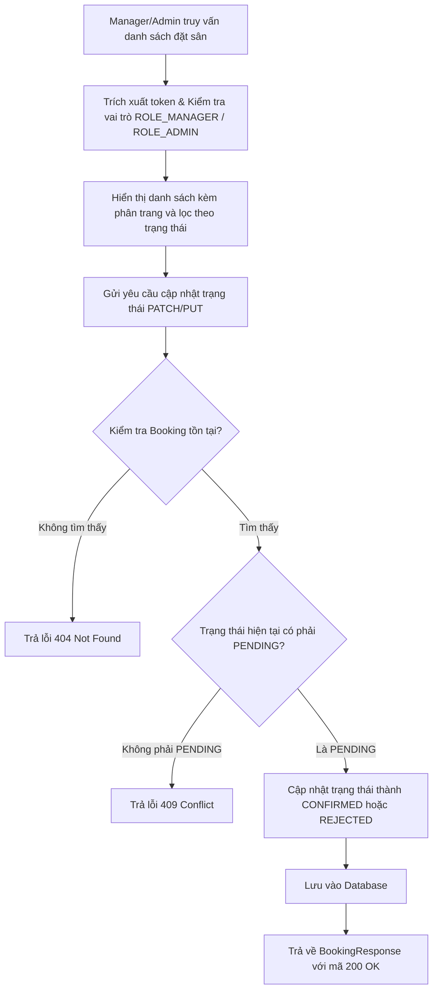

# Đặc Tả & Chi Tiết Triển Khai: Phê Duyệt / Từ Chối Lịch (FR-08)

Tính năng **Phê duyệt / Từ chối lịch (FR-08)** cho phép Quản lý (`ROLE_MANAGER`) hoặc Quản trị viên (`ROLE_ADMIN`) phê duyệt hoặc từ chối các yêu cầu đặt sân của khách hàng có trạng thái đang chờ xử lý (`PENDING`) thông qua các đầu API tương ứng.

---

## 📖 Luồng Nghiệp Vụ Hệ Thống (Business Flow Explanation)

Luồng xử lý nghiệp vụ phê duyệt hoặc từ chối lịch đặt sân được thực hiện qua các bước dưới đây:



1. **Phân quyền và bảo mật:** 
   - Yêu cầu người dùng phải đăng nhập và sở hữu vai trò tương ứng với đầu đường dẫn truy cập (`/api/v1/manager/bookings/**` cho `ROLE_MANAGER` và `/api/v1/admin/bookings/**` cho `ROLE_ADMIN`).
2. **Truy vấn danh sách đơn đặt lịch:**
   - Cung cấp API truy vấn tất cả các đơn đặt sân với tham số lọc tùy chọn `status`.
   - Sử dụng Constructor Projection của `BookingRepository` thông qua hàm `findBookingsByStatus` để truy xuất trực tiếp các trường cần thiết của DTO `BookingResponse`, hạn chế tải dữ liệu thừa.
   - Sắp xếp mặc định theo ngày đặt sân giảm dần (`bookingDate DESC`) và ID đơn đặt lịch giảm dần (`id DESC`).
3. **Cập nhật trạng thái đơn đặt lịch:**
   - Dữ liệu gửi lên được ràng buộc thông qua `BookingStatusUpdateRequest` chỉ chấp nhận các giá trị `"CONFIRMED"` hoặc `"REJECTED"` (sử dụng `@Pattern` validation).
   - Nếu đơn đặt lịch không tồn tại trong hệ thống, ném ra ngoại lệ `ResourceNotFoundException` (trả về mã HTTP `404 Not Found`).
   - Kiểm tra trạng thái hiện tại của đơn đặt lịch. Nếu trạng thái **khác** `"PENDING"`, hệ thống từ chối cập nhật và ném ra ngoại lệ `DuplicateResourceException` (trả về mã HTTP `409 Conflict`).
   - Nếu hợp lệ, hệ thống cập nhật trạng thái mới (`CONFIRMED` hoặc `REJECTED`) và trả về đối tượng `BookingResponse` cập nhật mới nhất.

---

## 🚀 Tài Liệu Hướng Dẫn Gọi API (API Specification)

### 1. Truy vấn danh sách đặt sân
*   **Method:** `GET`
*   **Path:** `/api/v1/manager/bookings` hoặc `/api/v1/admin/bookings`
*   **Access:** `ROLE_MANAGER` hoặc `ROLE_ADMIN` (Tương ứng theo tiền tố đường dẫn)
*   **Params:**
    - `status`: Lọc theo trạng thái (Ví dụ: `PENDING`, `CONFIRMED`, `REJECTED`). Không bắt buộc.
    - `page`: Số trang cần xem, bắt đầu từ `0` (mặc định: `0`).
    - `size`: Số lượng bản ghi mỗi trang (mặc định: `10`).

#### A. Trường hợp thành công (200 OK)
*   **Response (JSON):**
    ```json
    {
      "success": true,
      "message": "Bookings retrieved successfully",
      "data": {
        "content": [
          {
            "id": 1,
            "bookingDate": "2026-06-12",
            "timeSlot": "07:00 - 09:00",
            "totalPrice": 120000.00,
            "status": "PENDING",
            "courtName": "Sân Thảm A1",
            "clusterName": "Sân Cầu Lông Bình Thạnh",
            "customerFullName": "Tran Tri Customer"
          }
        ],
        "pageable": {
          "pageNumber": 0,
          "pageSize": 10,
          "sort": {
            "empty": false,
            "sorted": true,
            "unsorted": false
          },
          "offset": 0,
          "paged": true,
          "unpaged": false
        },
        "totalPages": 1,
        "totalElements": 1,
        "last": true,
        "size": 10,
        "number": 0,
        "sort": {
          "empty": false,
          "sorted": true,
          "unsorted": false
        },
        "numberOfElements": 1,
        "first": true,
        "empty": false
      }
    }
    ```

---

### 2. Cập nhật trạng thái đặt sân (Phê duyệt / Từ chối)
*   **Method:** `PUT`
*   **Path:** `/api/v1/manager/bookings/{id}` hoặc `/api/v1/admin/bookings/{id}`
*   **Access:** `ROLE_MANAGER` hoặc `ROLE_ADMIN` (Tương ứng theo tiền tố đường dẫn)
*   **Body (JSON Request):**
    ```json
    {
      "status": "CONFIRMED"
    }
    ```
    *(Giá trị hợp lệ của `status` là `"CONFIRMED"` hoặc `"REJECTED"`)*

#### A. Trường hợp thành công (200 OK)
*   **Response (JSON):**
    ```json
    {
      "success": true,
      "message": "Booking status updated successfully",
      "data": {
        "id": 1,
        "bookingDate": "2026-06-12",
        "timeSlot": "07:00 - 09:00",
        "totalPrice": 120000.00,
        "status": "CONFIRMED",
        "courtName": "Sân Thảm A1",
        "clusterName": "Sân Cầu Lông Bình Thạnh",
        "customerFullName": "Tran Tri Customer"
      }
    }
    ```

#### B. Trường hợp lỗi
*   **Lỗi Validation (400 Bad Request):** (Ví dụ: Truyền status rỗng hoặc khác giá trị cho phép)
    ```json
    {
      "timestamp": "2026-06-12T03:30:00",
      "status": 400,
      "error": "Bad Request",
      "message": "Validation failed",
      "path": "/api/v1/manager/bookings/1",
      "errors": {
        "status": "Status must be either CONFIRMED or REJECTED"
      }
    }
    ```
*   **Lỗi Không Tìm Thấy Đơn Đặt Lịch (404 Not Found):** (Đơn đặt lịch với ID tương ứng không tồn tại)
    ```json
    {
      "timestamp": "2026-06-12T03:30:00",
      "status": 409,
      "error": "Conflict",
      "message": "Booking not found with ID: 99",
      "path": "/api/v1/manager/bookings/99"
    }
    ```
    *(Lưu ý: Do cơ chế mapping ngoại lệ `ResourceNotFoundException` của `GlobalExceptionHandler` thiết lập status body là 409)*

*   **Lỗi Xử Lý Xung Đột Trạng Thái (409 Conflict):** (Đơn đặt lịch đã được xử lý trước đó và không còn ở trạng thái `PENDING`)
    ```json
    {
      "timestamp": "2026-06-12T03:30:00",
      "status": 409,
      "error": "Conflict",
      "message": "This booking has already been processed and is currently: CONFIRMED",
      "path": "/api/v1/manager/bookings/1"
    }
    ```

---

## 💻 Mã Nguồn Thay Đổi & Triển Khai (Source Code Implementations)

Dưới đây là các lớp và mã nguồn cụ thể được xây dựng và cập nhật để triển khai tính năng:

### 1. Lớp DTO nhận yêu cầu cập nhật trạng thái
*   **Đường dẫn:** [BookingStatusUpdateRequest.java](file:///d:/IT211/Me/src/main/java/atmin/controller/booking/dto/request/BookingStatusUpdateRequest.java)
```java
package atmin.controller.booking.dto.request;

import jakarta.validation.constraints.NotBlank;
import jakarta.validation.constraints.Pattern;
import lombok.*;

@Getter
@Setter
@NoArgsConstructor
@AllArgsConstructor
@Builder
public class BookingStatusUpdateRequest {
    @NotBlank(message = "Status is required")
    @Pattern(regexp = "^(CONFIRMED|REJECTED)$", message = "Status must be either CONFIRMED or REJECTED")
    private String status;
}
```

### 2. Bộ điều khiển API dành cho Manager
*   **Đường dẫn:** [BookingManagerController.java](file:///d:/IT211/Me/src/main/java/atmin/controller/booking/BookingManagerController.java)
```java
package atmin.controller.booking;

import atmin.common.response.ApiResponse;
import atmin.controller.booking.dto.request.BookingStatusUpdateRequest;
import atmin.controller.booking.dto.response.BookingResponse;
import atmin.service.IBookingService;
import jakarta.validation.Valid;
import lombok.RequiredArgsConstructor;
import org.springframework.data.domain.Page;
import org.springframework.data.domain.PageRequest;
import org.springframework.data.domain.Pageable;
import org.springframework.data.domain.Sort;
import org.springframework.http.ResponseEntity;
import org.springframework.web.bind.annotation.*;

@RestController
@RequestMapping("/api/v1")
@RequiredArgsConstructor
public class BookingManagerController {

    private final IBookingService bookingService;

    @GetMapping({"/manager/bookings", "/admin/bookings"})
    public ResponseEntity<ApiResponse<Page<BookingResponse>>> getBookings(
            @RequestParam(required = false) String status,
            @RequestParam(defaultValue = "0") int page,
            @RequestParam(defaultValue = "10") int size) {
        Pageable pageable = PageRequest.of(page, size, Sort.by("bookingDate").descending().and(Sort.by("id").descending()));
        Page<BookingResponse> bookings = bookingService.getBookings(status, pageable);
        return ResponseEntity.ok(ApiResponse.success("Bookings retrieved successfully", bookings));
    }

    @PutMapping({"/manager/bookings/{id}", "/admin/bookings/{id}"})
    public ResponseEntity<ApiResponse<BookingResponse>> updateBookingStatus(
            @PathVariable Long id,
            @Valid @RequestBody BookingStatusUpdateRequest request) {
        BookingResponse updatedBooking = bookingService.updateBookingStatus(id, request.getStatus());
        return ResponseEntity.ok(ApiResponse.success("Booking status updated successfully", updatedBooking));
    }
}
```

### 3. Khai báo các nghiệp vụ mới trong Interface Service
*   **Đường dẫn:** [IBookingService.java](file:///d:/IT211/Me/src/main/java/atmin/service/IBookingService.java)
```java
public interface IBookingService {
    // ... các phương thức cũ
    Page<BookingResponse> getBookings(String status, Pageable pageable);
    BookingResponse updateBookingStatus(Long id, String status);
}
```

### 4. Triển khai logic nghiệp vụ tại Service
*   **Đường dẫn:** [BookingService.java](file:///d:/IT211/Me/src/main/java/atmin/service/Impl/BookingService.java)
```java
    @Override
    @Transactional(readOnly = true)
    public Page<BookingResponse> getBookings(String status, Pageable pageable) {
        String statusFilter = (status == null || status.trim().isEmpty()) ? null : status.trim().toUpperCase();
        return bookingRepository.findBookingsByStatus(statusFilter, pageable);
    }

    @Override
    @Transactional
    public BookingResponse updateBookingStatus(Long id, String status) {
        Booking booking = bookingRepository.findById(id)
                .orElseThrow(() -> new ResourceNotFoundException("Booking not found with ID: " + id));

        // Ràng buộc chỉ cho phép phê duyệt hoặc từ chối đơn đặt lịch đang ở trạng thái PENDING
        if (!"PENDING".equalsIgnoreCase(booking.getStatus())) {
            throw new DuplicateResourceException("This booking has already been processed and is currently: " + booking.getStatus());
        }

        booking.setStatus(status.toUpperCase());
        bookingRepository.save(booking);

        return bookingRepository.findResponseById(id)
                .orElseThrow(() -> new ResourceNotFoundException("Booking response not found with ID: " + id));
    }
```

### 5. Truy vấn cơ sở dữ liệu tối ưu bằng Constructor Projection
*   **Đường dẫn:** [BookingRepository.java](file:///d:/IT211/Me/src/main/java/atmin/repository/BookingRepository.java)
```java
    @Query("SELECT new atmin.controller.booking.dto.response.BookingResponse(" +
           "b.id, b.bookingDate, b.timeSlot, b.totalPrice, b.status, " +
           "c.courtName, cl.name, u.fullName) " +
           "FROM Booking b " +
           "JOIN b.court c " +
           "JOIN c.cluster cl " +
           "JOIN b.user u " +
           "WHERE (:status IS NULL OR b.status = :status) " +
           "AND b.isDeleted = false")
    Page<BookingResponse> findBookingsByStatus(@Param("status") String status, Pageable pageable);
```

### 6. Cấu hình phân quyền truy cập trong Spring Security
*   **Đường dẫn:** [SecurityConfig.java](file:///d:/IT211/Me/src/main/java/atmin/infrastructure/security/SecurityConfig.java)
```java
    @Bean
    public SecurityFilterChain filterChain(HttpSecurity http) throws Exception {
        http
            .csrf(AbstractHttpConfigurer::disable)
            .authorizeHttpRequests(auth -> auth
                    // ... các quy tắc khác
                    .requestMatchers("/api/v1/admin/**").hasAuthority("ROLE_ADMIN")
                    .requestMatchers("/api/v1/manager/**").hasAuthority("ROLE_MANAGER")
                    // ...
            );
        return http.build();
    }
```

---

## 🛠️ Kết Quả Kiểm Tra Xác Minh

Việc biên dịch hệ thống và chạy toàn bộ bộ kiểm thử tự động đã hoàn thành xuất sắc:
```text
BUILD SUCCESSFUL in 15s
4 actionable tasks: 1 executed, 3 up-to-date
```
Các chức năng phê duyệt, từ chối và quản lý danh sách đặt sân của vai trò quản lý đều hoạt động chính xác theo đặc tả yêu cầu nghiệp vụ.
