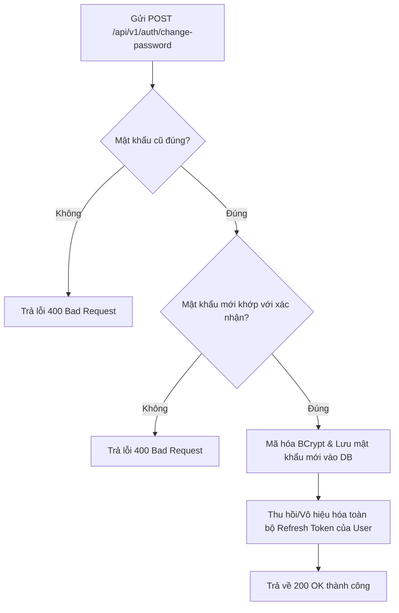
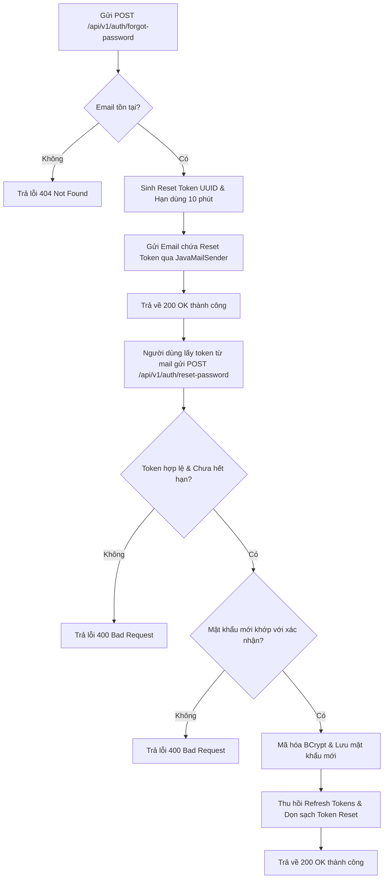

# Đặc Tả & Chi Tiết Triển Khai: Đổi mật khẩu / Quên mật khẩu (FR-10)

Tính năng **Đổi mật khẩu / Quên mật khẩu (FR-10)** cho phép người dùng đổi mật khẩu khi đang đăng nhập, hoặc khôi phục tài khoản thông qua thư điện tử (email) chứa mã khôi phục sử dụng dịch vụ Spring Mail (`JavaMailSender`).

---

## 💻 Danh Sách Các File Thay Đổi & Triển Khai (Source Code Implementations)

Dưới đây là chi tiết mã nguồn các tệp tin Java đã được tạo mới hoặc thay đổi để triển khai tính năng FR-10:

### 1. Tầng Thực Thể (Entity)

#### [MODIFY] [User.java](file:///d:/IT211/Me/src/main/java/atmin/entity/User.java)
- Chi tiết toàn bộ nội dung file sau khi chỉnh sửa:
```java
package atmin.entity;

import jakarta.persistence.*;
import lombok.*;
import org.hibernate.annotations.SQLDelete;
import org.hibernate.annotations.SQLRestriction;
import org.jspecify.annotations.NullMarked;
import org.springframework.security.core.GrantedAuthority;
import org.springframework.security.core.userdetails.UserDetails;

import java.time.LocalDateTime;
import java.util.Collection;
import java.util.Set;

@Entity
@Table(name = "users",
        indexes = @Index(name = "idx_username",
                columnList = "username",
                unique = true)
)
@Getter
@Setter
@NoArgsConstructor
@AllArgsConstructor
@Builder
@SQLDelete(sql = "update users set is_deleted = true, updated_at = NOW(), is_enabled = false where id = ?")
@SQLRestriction("is_deleted = false")
public class User extends BaseEntity implements UserDetails {
    @Id
    @GeneratedValue(strategy = GenerationType.IDENTITY)
    private Long id;
    
    private String username;
    private String password;
    private String fullName;
    private String email;

    @Column(name = "phone_number", length = 20)
    private String phoneNumber;

    @Builder.Default
    @Column(name = "is_enabled")
    private boolean isEnabled = true;

    @Column(name = "reset_token")
    private String resetToken;

    @Column(name = "reset_token_expiry")
    private LocalDateTime resetTokenExpiry;


    @JoinTable(
            name = "user_role",
            joinColumns = @JoinColumn(name = "user_id"),
            inverseJoinColumns = @JoinColumn(name = "role_id")
    )
    @ManyToMany(fetch = FetchType.EAGER)
    private Set<Role> roles;

    @Transient
    private Collection<? extends GrantedAuthority> authorities;

    @Override
    @NullMarked
    public Collection<? extends GrantedAuthority> getAuthorities() {
        return authorities;
    }

    @Override
    public String getPassword() {
        return this.password;
    }

    @Override
    @NullMarked
    public String getUsername() {
        return this.username;
    }

    @Override
    @NullMarked
    public boolean isAccountNonExpired() {
        return true;
    }

    @Override
    @NullMarked
    public boolean isAccountNonLocked() {
        return true;
    }

    @Override
    @NullMarked
    public boolean isCredentialsNonExpired() {
        return true;
    }

    @Override
    @NullMarked
    public boolean isEnabled() {
        return this.isEnabled && !this.isDeleted();
    }
}
```

---

### 2. Tầng Truy Vấn (Repository)

#### [MODIFY] [UserRepository.java](file:///d:/IT211/Me/src/main/java/atmin/repository/UserRepository.java)
- Chi tiết toàn bộ nội dung file sau khi chỉnh sửa:
```java
package atmin.repository;

import atmin.entity.User;
import org.springframework.data.domain.Page;
import org.springframework.data.domain.Pageable;
import org.springframework.data.jpa.repository.JpaRepository;
import org.springframework.data.jpa.repository.Query;
import org.springframework.data.repository.query.Param;
import java.util.Optional;

public interface UserRepository extends JpaRepository<User, Long> {
    Optional<User> findByUsername(String username);
    Optional<User> findByEmail(String email);
    Optional<User> findByResetToken(String resetToken);
    boolean existsByUsername(String username);
    boolean existsByEmail(String email);
    boolean existsByPhoneNumber(String phoneNumber);

    @Query("SELECT u FROM User u WHERE " +
           "(:keyword IS NULL OR :keyword = '' OR " +
           "LOWER(u.username) LIKE LOWER(CONCAT('%', :keyword, '%')) OR " +
           "LOWER(u.email) LIKE LOWER(CONCAT('%', :keyword, '%')) OR " +
           "LOWER(u.fullName) LIKE LOWER(CONCAT('%', :keyword, '%')))")
    Page<User> searchUsers(@Param("keyword") String keyword, Pageable pageable);
}
```

---

### 3. Tầng Gửi Email (Email Service)

#### [NEW] [IEmailService.java](file:///d:/IT211/Me/src/main/java/atmin/service/IEmailService.java)
- Chi tiết toàn bộ nội dung file mới:
```java
package atmin.service;

public interface IEmailService {
    void sendResetPasswordEmail(String toEmail, String token);
}
```

#### [NEW] [EmailService.java](file:///d:/IT211/Me/src/main/java/atmin/service/Impl/EmailService.java)
- Chi tiết toàn bộ nội dung file mới:
```java
package atmin.service.Impl;

import atmin.service.IEmailService;
import jakarta.mail.MessagingException;
import jakarta.mail.internet.MimeMessage;
import lombok.RequiredArgsConstructor;
import lombok.extern.slf4j.Slf4j;
import org.springframework.mail.javamail.JavaMailSender;
import org.springframework.mail.javamail.MimeMessageHelper;
import org.springframework.stereotype.Service;

@Service
@RequiredArgsConstructor
@Slf4j
public class EmailService implements IEmailService {
    private final JavaMailSender mailSender;

    @Override
    public void sendResetPasswordEmail(String toEmail, String token) {
        try {
            MimeMessage message = mailSender.createMimeMessage();
            MimeMessageHelper helper = new MimeMessageHelper(message, true, "UTF-8");

            helper.setTo(toEmail);
            helper.setSubject("🏸 Đặt lại mật khẩu tài khoản cầu lông của bạn");

            String content = "<h3>Xin chào,</h3>"
                    + "<p>Bạn đã yêu cầu đặt lại mật khẩu cho tài khoản đăng ký bằng email này.</p>"
                    + "<p>Vui lòng sử dụng mã thông báo reset (Reset Token) dưới đây để thực hiện thay đổi mật khẩu của bạn:</p>"
                    + "<p style='font-size: 18px; font-weight: bold; color: #1e88e5; background-color: #f5f5f5; padding: 10px; display: inline-block; border-radius: 4px;'>" + token + "</p>"
                    + "<p>Mã thông báo này sẽ <b>hết hạn trong 10 phút</b>.</p>"
                    + "<p>Nếu bạn không gửi yêu cầu này, vui lòng bỏ qua email này.</p>"
                    + "<br/>"
                    + "<p>Trân trọng,<br/>Đội ngũ Cầu Lông Atmin</p>";

            helper.setText(content, true);

            mailSender.send(message);
            log.info("Reset password email successfully sent to {}", toEmail);

        } catch (MessagingException e) {
            log.error("Failed to send reset password email to {}", toEmail, e);
            throw new RuntimeException("Failed to send reset password email", e);
        }
    }
}
```

---

### 4. Các Lớp DTO Yêu Cầu (Request DTOs)

#### [NEW] [ChangePasswordRequest.java](file:///d:/IT211/Me/src/main/java/atmin/controller/auth/dto/request/ChangePasswordRequest.java)
- Chi tiết toàn bộ nội dung file mới:
```java
package atmin.controller.auth.dto.request;

import jakarta.validation.constraints.NotBlank;
import jakarta.validation.constraints.Size;
import lombok.AllArgsConstructor;
import lombok.Getter;
import lombok.NoArgsConstructor;
import lombok.Setter;

@Getter
@Setter
@NoArgsConstructor
@AllArgsConstructor
public class ChangePasswordRequest {
    @NotBlank(message = "Old password is required")
    private String oldPassword;

    @NotBlank(message = "New password is required")
    @Size(min = 6, message = "Password must be at least 6 characters long")
    private String newPassword;

    @NotBlank(message = "Confirm password is required")
    private String confirmPassword;
}
```

#### [NEW] [ForgotPasswordRequest.java](file:///d:/IT211/Me/src/main/java/atmin/controller/auth/dto/request/ForgotPasswordRequest.java)
- Chi tiết toàn bộ nội dung file mới:
```java
package atmin.controller.auth.dto.request;

import jakarta.validation.constraints.Email;
import jakarta.validation.constraints.NotBlank;
import lombok.AllArgsConstructor;
import lombok.Getter;
import lombok.NoArgsConstructor;
import lombok.Setter;

@Getter
@Setter
@NoArgsConstructor
@AllArgsConstructor
public class ForgotPasswordRequest {
    @NotBlank(message = "Email is required")
    @Email(message = "Invalid email format")
    private String email;
}
```

#### [NEW] [ResetPasswordRequest.java](file:///d:/IT211/Me/src/main/java/atmin/controller/auth/dto/request/ResetPasswordRequest.java)
- Chi tiết toàn bộ nội dung file mới:
```java
package atmin.controller.auth.dto.request;

import jakarta.validation.constraints.NotBlank;
import jakarta.validation.constraints.Size;
import lombok.AllArgsConstructor;
import lombok.Getter;
import lombok.NoArgsConstructor;
import lombok.Setter;

@Getter
@Setter
@NoArgsConstructor
@AllArgsConstructor
public class ResetPasswordRequest {
    @NotBlank(message = "Reset token is required")
    private String token;

    @NotBlank(message = "New password is required")
    @Size(min = 6, message = "Password must be at least 6 characters long")
    private String newPassword;

    @NotBlank(message = "Confirm password is required")
    private String confirmPassword;
}
```

---

### 5. Tầng Nghiệp Vụ Xác Thực (Auth Service)

#### [MODIFY] [IAuthService.java](file:///d:/IT211/Me/src/main/java/atmin/service/IAuthService.java)
- Chi tiết toàn bộ nội dung file sau khi chỉnh sửa:
```java
package atmin.service;

import atmin.common.response.ApiResponse;
import atmin.controller.auth.dto.request.LoginRequest;
import atmin.controller.auth.dto.request.RegisterRequest;
import atmin.controller.auth.dto.response.AuthResponse;
import atmin.controller.auth.dto.request.ChangePasswordRequest;
import atmin.controller.auth.dto.request.ForgotPasswordRequest;
import atmin.controller.auth.dto.request.ResetPasswordRequest;
import org.springframework.http.ResponseEntity;

public interface IAuthService {
    ResponseEntity<ApiResponse<Void>> register(RegisterRequest request);
    ResponseEntity<ApiResponse<AuthResponse>> login(LoginRequest request);
    ResponseEntity<ApiResponse<AuthResponse>> refreshToken(String refreshToken);
    ResponseEntity<ApiResponse<Void>> logout(String authHeader);
    ResponseEntity<ApiResponse<Void>> changePassword(String username, ChangePasswordRequest request);
    ResponseEntity<ApiResponse<Void>> forgotPassword(ForgotPasswordRequest request);
    ResponseEntity<ApiResponse<Void>> resetPassword(ResetPasswordRequest request);
}
```

#### [MODIFY] [AuthService.java](file:///d:/IT211/Me/src/main/java/atmin/service/Impl/AuthService.java)
- Chi tiết toàn bộ nội dung file sau khi chỉnh sửa:
```java
package atmin.service.Impl;

import atmin.common.exception.DuplicateResourceException;
import atmin.common.exception.ResourceNotFoundException;
import atmin.common.response.ApiResponse;
import atmin.controller.auth.dto.request.LoginRequest;
import atmin.controller.auth.dto.request.RegisterRequest;
import atmin.controller.auth.dto.response.AuthResponse;
import atmin.entity.RefreshToken;
import atmin.entity.Role;
import atmin.entity.User;
import atmin.entity.TokenBlacklist;
import atmin.repository.TokenBlacklistRepository;
import atmin.controller.auth.dto.request.ChangePasswordRequest;
import atmin.controller.auth.dto.request.ForgotPasswordRequest;
import atmin.controller.auth.dto.request.ResetPasswordRequest;
import atmin.service.IEmailService;
import java.util.UUID;
import java.time.ZoneId;
import java.util.Date;
import atmin.infrastructure.security.jwt.JwtProperties;
import atmin.infrastructure.security.jwt.JwtProvider;
import atmin.repository.RefreshTokenRepository;
import atmin.repository.RoleRepository;
import atmin.repository.UserRepository;
import atmin.service.IAuthService;
import io.jsonwebtoken.JwtException;
import lombok.RequiredArgsConstructor;
import lombok.extern.slf4j.Slf4j;
import org.springframework.http.HttpStatus;
import org.springframework.http.ResponseEntity;
import org.springframework.security.authentication.AuthenticationManager;
import org.springframework.security.authentication.UsernamePasswordAuthenticationToken;
import org.springframework.security.crypto.password.PasswordEncoder;
import org.springframework.stereotype.Service;
import org.springframework.transaction.annotation.Transactional;

import java.time.LocalDateTime;
import java.time.temporal.ChronoUnit;
import java.util.List;

@Service
@RequiredArgsConstructor
@Slf4j
public class AuthService implements IAuthService {
    private final UserRepository userRepository;
    private final RoleRepository roleRepository;
    private final PasswordEncoder passwordEncoder;
    private final AuthenticationManager authenticationManager;
    private final RefreshTokenRepository refreshTokenRepository;
    private final JwtProvider jwtProvider;
    private final JwtProperties jwtProperties;
    private final TokenBlacklistRepository tokenBlacklistRepository;
    private final IEmailService emailService;

    @Override
    public ResponseEntity<ApiResponse<Void>> register(RegisterRequest request) {
        if (userRepository.existsByUsername(request.getUsername())) {
            throw new DuplicateResourceException("Username already exists!");
        }

        if (userRepository.existsByEmail(request.getEmail())) {
            throw new DuplicateResourceException("Email already exists!");
        }

        if (userRepository.existsByPhoneNumber(request.getPhoneNumber())) {
            throw new DuplicateResourceException("Phone number already exists!");
        }

        Role roleUser = roleRepository.findByName("ROLE_CUSTOMER")
                .orElseThrow(() ->
                        new ResourceNotFoundException("ROLE_CUSTOMER not found"));

        User newUser = request.toEntity(passwordEncoder.encode(request.getPassword()), roleUser);
        userRepository.save(newUser);

        ApiResponse<Void> response = ApiResponse.success("User registered successfully!");
        return new ResponseEntity<>(response, HttpStatus.CREATED);
    }

    @Override
    public ResponseEntity<ApiResponse<AuthResponse>> login(LoginRequest request) {
        authenticationManager.authenticate(
                new UsernamePasswordAuthenticationToken(request.getUsername(), request.getPassword()));
        log.info("{} logged in successfully", request.getUsername());

        User user = userRepository.findByUsername(request.getUsername())
                .orElseThrow(() -> new ResourceNotFoundException("User not found!"));

        String accessToken = jwtProvider.generateAccessToken(user);
        String refreshToken = jwtProvider.generateRefreshToken(user);

        List<RefreshToken> activeTokens = refreshTokenRepository.findAllActiveByUser(user);
        if (activeTokens != null && !activeTokens.isEmpty()) {
            activeTokens.forEach(t -> t.setRevoked(true));
            refreshTokenRepository.saveAll(activeTokens);
        }

        LocalDateTime expiryDateTime = LocalDateTime.now()
                .plus(jwtProperties.getRefreshExpiration(), ChronoUnit.MILLIS);

        RefreshToken refreshEntity = RefreshToken.builder()
                .token(refreshToken)
                .user(user)
                .expiredAt(expiryDateTime)
                .isRevoked(false)
                .build();
        refreshTokenRepository.save(refreshEntity);

        ApiResponse<AuthResponse> response = ApiResponse.success("Login successfully!",
                new AuthResponse(accessToken, refreshToken));

        return new ResponseEntity<>(response, HttpStatus.OK);
    }

    @Override
    public ResponseEntity<ApiResponse<AuthResponse>> refreshToken(String refreshToken) {

        jwtProvider.validateRefreshToken(refreshToken);

        RefreshToken tokenEntity = refreshTokenRepository.findByToken(refreshToken)
                .orElseThrow(() -> new ResourceNotFoundException("Refresh token not found"));

        if (tokenEntity.isRevoked()) {
            List<RefreshToken> activeTokens = refreshTokenRepository.findAllActiveByUser(tokenEntity.getUser());
            if (activeTokens != null && !activeTokens.isEmpty()) {
                activeTokens.forEach(t -> t.setRevoked(true));
                refreshTokenRepository.saveAll(activeTokens);
            }
            throw new JwtException("Refresh token has been revoked due to potential reuse attack");
        }

        User user = tokenEntity.getUser();
        String newAccessToken = jwtProvider.generateAccessToken(user);
        String newRefreshToken = jwtProvider.generateRefreshToken(user);

        // Thu hồi token cũ và lưu token mới
        tokenEntity.setRevoked(true);
        refreshTokenRepository.save(tokenEntity);

        // Tránh bị tràn
        LocalDateTime expiryDateTime = LocalDateTime.now()
                .plus(jwtProperties.getRefreshExpiration(), ChronoUnit.MILLIS);

        RefreshToken newRefreshEntity = RefreshToken.builder()
                .token(newRefreshToken)
                .user(user)
                .expiredAt(expiryDateTime)
                .isRevoked(false)
                .build();
        refreshTokenRepository.save(newRefreshEntity);

        ApiResponse<AuthResponse> response = ApiResponse.success("Refresh successfully!",
                new AuthResponse(newAccessToken, newRefreshToken));

        return new ResponseEntity<>(response, HttpStatus.OK);
    }

    @Override
    @Transactional
    public ResponseEntity<ApiResponse<Void>> logout(String authHeader) {
        if (authHeader == null || !authHeader.startsWith("Bearer ")) {
            throw new JwtException("Full authentication is required to access this resource");
        }

        String token = authHeader.substring(7);
        jwtProvider.validateAccessToken(token);

        String username = jwtProvider.getUsernameFromToken(token);
        User user = userRepository.findByUsername(username)
                .orElseThrow(() -> new ResourceNotFoundException("User not found for this token: " + username));

        Date expirationDate = jwtProvider.getExpirationDateFromToken(token);
        LocalDateTime expiryTime = expirationDate.toInstant()
                .atZone(ZoneId.systemDefault())
                .toLocalDateTime();

        TokenBlacklist blacklist = TokenBlacklist.builder()
                .token(token)
                .expiryTime(expiryTime)
                .user(user)
                .build();
        tokenBlacklistRepository.save(blacklist);

        return new ResponseEntity<>(ApiResponse.success("Logout successfully!"), HttpStatus.OK);
    }

    @Override
    @Transactional
    public ResponseEntity<ApiResponse<Void>> changePassword(String username, ChangePasswordRequest request) {
        User user = userRepository.findByUsername(username)
                .orElseThrow(() -> new ResourceNotFoundException("User not found with username: " + username));

        if (!passwordEncoder.matches(request.getOldPassword(), user.getPassword())) {
            throw new IllegalArgumentException("Old password does not match!");
        }

        if (!request.getNewPassword().equals(request.getConfirmPassword())) {
            throw new IllegalArgumentException("New password and confirm password do not match!");
        }

        user.setPassword(passwordEncoder.encode(request.getNewPassword()));
        userRepository.save(user);

        // Thu hồi tất cả Refresh Token cũ của User để bắt đăng nhập lại
        List<RefreshToken> activeTokens = refreshTokenRepository.findAllActiveByUser(user);
        if (activeTokens != null && !activeTokens.isEmpty()) {
            activeTokens.forEach(t -> t.setRevoked(true));
            refreshTokenRepository.saveAll(activeTokens);
        }

        return new ResponseEntity<>(ApiResponse.success("Password changed successfully!"), HttpStatus.OK);
    }

    @Override
    @Transactional
    public ResponseEntity<ApiResponse<Void>> forgotPassword(ForgotPasswordRequest request) {
        User user = userRepository.findByEmail(request.getEmail())
                .orElseThrow(() -> new ResourceNotFoundException("Email does not exist!"));

        String token = UUID.randomUUID().toString();
        user.setResetToken(token);
        user.setResetTokenExpiry(LocalDateTime.now().plusMinutes(10));
        userRepository.save(user);

        emailService.sendResetPasswordEmail(user.getEmail(), token);

        ApiResponse<Void> response = ApiResponse.success("Password reset email sent successfully. Please check your inbox.");
        return new ResponseEntity<>(response, HttpStatus.OK);
    }

    @Override
    @Transactional
    public ResponseEntity<ApiResponse<Void>> resetPassword(ResetPasswordRequest request) {
        User user = userRepository.findByResetToken(request.getToken())
                .orElseThrow(() -> new IllegalArgumentException("Invalid or expired reset token!"));

        if (user.getResetTokenExpiry().isBefore(LocalDateTime.now())) {
            throw new IllegalArgumentException("Invalid or expired reset token!");
        }

        if (!request.getNewPassword().equals(request.getConfirmPassword())) {
            throw new IllegalArgumentException("New password and confirm password do not match!");
        }

        user.setPassword(passwordEncoder.encode(request.getNewPassword()));
        user.setResetToken(null);
        user.setResetTokenExpiry(null);
        userRepository.save(user);

        // Thu hồi tất cả Refresh Token cũ
        List<RefreshToken> activeTokens = refreshTokenRepository.findAllActiveByUser(user);
        if (activeTokens != null && !activeTokens.isEmpty()) {
            activeTokens.forEach(t -> t.setRevoked(true));
            refreshTokenRepository.saveAll(activeTokens);
        }

        return new ResponseEntity<>(ApiResponse.success("Password reset successfully!"), HttpStatus.OK);
    }
}
```

---

### 6. Tầng Điều Hướng API (Controller)

#### [MODIFY] [AuthController.java](file:///d:/IT211/Me/src/main/java/atmin/controller/auth/AuthController.java)
- Chi tiết toàn bộ nội dung file sau khi chỉnh sửa:
```java
package atmin.controller.auth;

import atmin.common.response.ApiResponse;
import atmin.controller.auth.dto.request.LoginRequest;
import atmin.controller.auth.dto.request.RefreshTokenRequest;
import atmin.controller.auth.dto.request.RegisterRequest;
import atmin.controller.auth.dto.response.AuthResponse;
import atmin.service.IAuthService;
import jakarta.validation.Valid;
import lombok.RequiredArgsConstructor;
import org.springframework.http.ResponseEntity;
import org.springframework.web.bind.annotation.*;

import atmin.controller.auth.dto.request.ChangePasswordRequest;
import atmin.controller.auth.dto.request.ForgotPasswordRequest;
import atmin.controller.auth.dto.request.ResetPasswordRequest;
import java.security.Principal;

@RestController
@RequestMapping("/api/v1/auth")
@RequiredArgsConstructor
public class AuthController {
    private final IAuthService authService;

    @PostMapping("/register")
    public ResponseEntity<ApiResponse<Void>> register(@Valid @RequestBody RegisterRequest request) {
        return authService.register(request);
    }

    @PostMapping("/login")
    public ResponseEntity<ApiResponse<AuthResponse>> login(@Valid @RequestBody LoginRequest request) {
        return authService.login(request);
    }

    @PostMapping("/refresh")
    public ResponseEntity<ApiResponse<AuthResponse>> refreshToken(@Valid @RequestBody RefreshTokenRequest request) {
        return authService.refreshToken(request.getRefreshToken());
    }

    @PostMapping("/logout")
    public ResponseEntity<ApiResponse<Void>> logout(@RequestHeader(value = "Authorization", required = false) String authHeader) {
        return authService.logout(authHeader);
    }

    @PostMapping("/change-password")
    public ResponseEntity<ApiResponse<Void>> changePassword(
            @Valid @RequestBody ChangePasswordRequest request,
            Principal principal) {
        return authService.changePassword(principal.getName(), request);
    }

    @PostMapping("/forgot-password")
    public ResponseEntity<ApiResponse<Void>> forgotPassword(@Valid @RequestBody ForgotPasswordRequest request) {
        return authService.forgotPassword(request);
    }

    @PostMapping("/reset-password")
    public ResponseEntity<ApiResponse<Void>> resetPassword(@Valid @RequestBody ResetPasswordRequest request) {
        return authService.resetPassword(request);
    }
}
```

---

### 7. Cấu Hình Bảo Mật (Security Config)

#### [MODIFY] [SecurityConfig.java](file:///d:/IT211/Me/src/main/java/atmin/infrastructure/security/SecurityConfig.java)
- Chi tiết toàn bộ nội dung file sau khi chỉnh sửa:
```java
package atmin.infrastructure.security;

import atmin.infrastructure.security.jwt.JwtAuthenticationFilter;
import lombok.RequiredArgsConstructor;
import org.springframework.context.annotation.Bean;
import org.springframework.context.annotation.Configuration;
import org.springframework.security.authentication.AuthenticationManager;
import org.springframework.security.config.annotation.authentication.configuration.AuthenticationConfiguration;
import org.springframework.security.config.annotation.web.builders.HttpSecurity;
import org.springframework.security.config.annotation.web.configuration.EnableWebSecurity;
import org.springframework.security.config.annotation.web.configurers.AbstractHttpConfigurer;
import org.springframework.security.config.http.SessionCreationPolicy;
import org.springframework.security.crypto.bcrypt.BCryptPasswordEncoder;
import org.springframework.security.crypto.password.PasswordEncoder;
import org.springframework.security.web.SecurityFilterChain;
import org.springframework.security.web.authentication.UsernamePasswordAuthenticationFilter;
import org.springframework.security.web.AuthenticationEntryPoint;
import org.springframework.security.web.access.AccessDeniedHandler;
import tools.jackson.databind.ObjectMapper;


@Configuration
@RequiredArgsConstructor
@EnableWebSecurity
public class SecurityConfig {
    private final JwtAuthenticationFilter jwtAuthenticationFilter;
    private final ObjectMapper objectMapper;

    @Bean
    public PasswordEncoder passwordEncoder() {
        return new BCryptPasswordEncoder();
    }

    @Bean
    public AuthenticationManager authenticationManager(AuthenticationConfiguration authenticationConfiguration) {
        return authenticationConfiguration.getAuthenticationManager();
    }

    @Bean
    public AuthenticationEntryPoint authenticationEntryPoint() {
        return (request, response, authException) -> {
            atmin.common.response.ApiErrorResponse errorResponse = atmin.common.response.ApiErrorResponse.builder()
                    .timestamp(java.time.LocalDateTime.now())
                    .status(org.springframework.http.HttpStatus.UNAUTHORIZED.value())
                    .error(org.springframework.http.HttpStatus.UNAUTHORIZED.getReasonPhrase())
                    .message("Full authentication is required to access this resource")
                    .path(request.getRequestURI())
                    .build();

            response.setStatus(jakarta.servlet.http.HttpServletResponse.SC_UNAUTHORIZED);
            response.setContentType("application/json;charset=UTF-8");
            response.getWriter().write(objectMapper.writeValueAsString(errorResponse));
        };
    }

    @Bean
    public AccessDeniedHandler accessDeniedHandler() {
        return (request, response, accessDeniedException) -> {
            atmin.common.response.ApiErrorResponse errorResponse = atmin.common.response.ApiErrorResponse.builder()
                    .timestamp(java.time.LocalDateTime.now())
                    .status(org.springframework.http.HttpStatus.FORBIDDEN.value())
                    .error(org.springframework.http.HttpStatus.FORBIDDEN.getReasonPhrase())
                    .message("Access Denied")
                    .path(request.getRequestURI())
                    .build();

            response.setStatus(jakarta.servlet.http.HttpServletResponse.SC_FORBIDDEN);
            response.setContentType("application/json;charset=UTF-8");
            response.getWriter().write(objectMapper.writeValueAsString(errorResponse));
        };
    }

    @Bean
    public SecurityFilterChain filterChain(HttpSecurity http) {
        http
            .csrf(AbstractHttpConfigurer::disable)
            .authorizeHttpRequests(auth -> auth
                    .requestMatchers("/api/v1/auth/change-password").authenticated()
                    .requestMatchers("/api/v1/auth/**", "/error").permitAll()
                    .requestMatchers("/api/v1/admin/**").hasAuthority("ROLE_ADMIN")
                    .requestMatchers("/api/v1/manager/**").hasAuthority("ROLE_MANAGER")
                    .requestMatchers("/api/v1/customer/**").hasAuthority("ROLE_CUSTOMER")
                    .anyRequest().authenticated())
            .sessionManagement(s -> s.sessionCreationPolicy(SessionCreationPolicy.STATELESS))
            .exceptionHandling(exception -> exception
                    .authenticationEntryPoint(authenticationEntryPoint())
                    .accessDeniedHandler(accessDeniedHandler())
            )
            .addFilterBefore(jwtAuthenticationFilter, UsernamePasswordAuthenticationFilter.class);
        return http.build();
    }
}
```

---

## 📖 Luồng Nghiệp Vụ Hệ Thống (Business Flow Explanation)

### 1. Đổi mật khẩu (Change Password)


### 2. Quên mật khẩu (Forgot & Reset Password)


---

## 🚀 Tài Liệu Hướng Dẫn Gọi API (API Specification)

### 1. Đổi mật khẩu (`POST /api/v1/auth/change-password`)
*   **Access:** `Authenticated` (Yêu cầu JWT Token hợp lệ)
*   **Headers:**
    - `Authorization`: `Bearer <token>`
    - `Content-Type`: `application/json`
*   **Body (JSON Request):**
    ```json
    {
      "oldPassword": "password123",
      "newPassword": "newPassword123",
      "confirmPassword": "newPassword123"
    }
    ```
*   **Response (JSON - 200 OK):**
    ```json
    {
      "success": true,
      "message": "Password changed successfully!"
    }
    ```

---

### 2. Yêu cầu đặt lại mật khẩu (`POST /api/v1/auth/forgot-password`)
*   **Access:** `Public` (Không yêu cầu Token)
*   **Headers:** `Content-Type: application/json`
*   **Body (JSON Request):**
    ```json
    {
      "email": "customer@example.com"
    }
    ```
*   **Response (JSON - 200 OK):**
    ```json
    {
      "success": true,
      "message": "Password reset email sent successfully. Please check your inbox."
    }
    ```

---

### 3. Đặt lại mật khẩu mới (`POST /api/v1/auth/reset-password`)
*   **Access:** `Public` (Không yêu cầu Token)
*   **Headers:** `Content-Type: application/json`
*   **Body (JSON Request):**
    ```json
    {
      "token": "98e4f164-320d-4089-a9a3-5c02b37dc87e",
      "newPassword": "newPassword123",
      "confirmPassword": "newPassword123"
    }
    ```
*   **Response (JSON - 200 OK):**
    ```json
    {
      "success": true,
      "message": "Password reset successfully!"
    }
    ```

---

## 🧪 Hướng Dẫn Kiểm Thử (API Testing Guide)

### Bước 1: Cấu hình tài khoản SMTP trong file `.env`
Mở file [.env](file:///d:/IT211/Me/.env) và điền thông tin tài khoản SMTP của bạn:
```env
MAIL_USERNAME=wer.company.edu@gmail.com
MAIL_PASSWORD=teptfccamzwfkvse
```
*(Thông tin tài khoản này được lưu trữ trong file `.env` cục bộ và file này đã được thêm vào `.gitignore` để tránh bị rò rỉ khi đẩy code lên Github).*

### Bước 2: Test API Đổi Mật Khẩu
1. Gửi request đăng nhập `POST /api/v1/auth/login` bằng tài khoản `customer_test` / `password123`.
2. Sao chép `accessToken` từ phản hồi.
3. Gửi request `POST /api/v1/auth/change-password` với Header `Authorization: Bearer <accessToken>` và body:
   ```json
   {
     "oldPassword": "password123",
     "newPassword": "newPassword123",
     "confirmPassword": "newPassword123"
   }
   ```
4. Xác nhận kết quả trả về `200 OK` và thử đăng nhập lại bằng mật khẩu mới.

### Bước 3: Test API Quên Mật Khẩu & Reset Mật Khẩu
1. Gửi request `POST /api/v1/auth/forgot-password` với body chứa email đăng ký của người dùng trong hệ thống (ví dụ: `customer@example.com` của tài khoản `customer_test`):
   ```json
   {
     "email": "customer@example.com"
   }
   ```
2. Kiểm tra hộp thư đến của email trên. Bạn sẽ nhận được 1 email chứa mã Reset Token.
3. Gửi request `POST /api/v1/auth/reset-password` truyền token trên để đặt lại mật khẩu mới:
   ```json
   {
     "token": "<token_trong_email>",
     "newPassword": "password123",
     "confirmPassword": "password123"
   }
   ```
4. Thử đăng nhập lại tài khoản bằng mật khẩu `password123` để xác minh thành công.
